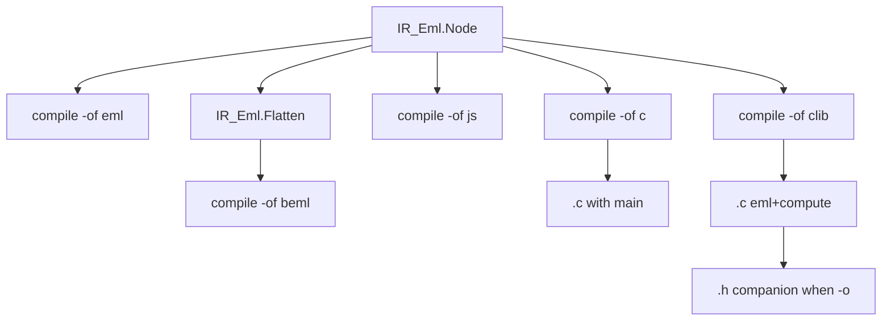

# Compile C and clib backends

Stay on **`feature/compile-js`**. Do **not** create a new branch. Do not implement on `main`. Keep this plan under [`.cursor/plans/`](.cursor/plans/) (never delete plan files). Commit it with the feature work when committing.

## Locked product decisions

- **Two new compile `-of` values:** `c` and `clib` (not `c-lib` / `h`). Default compile format stays **`beml`**. Same-format rejection unchanged (`eml`→`eml`, `beml`→`beml` only). Both are output-only; all four inputs may compile to either.
- **IR only.** Reuse [`Load_IR`](src/eml-cli.adb) and walk `IR_Eml.Node` (same nested style as [`Js_Backend`](src/js_backend.ads)). No Flatten. No mxeml AST. Separate package(s), not inside [`IR_Eml`](src/ir_eml.ads).
- **Numerics:** `#include <complex.h>`; type `long double complex`; `cexpl` / `clogl` / `creall` / `cimagl`. `One_Node` → `(1.0L + 0.0L * I)`; `Eml_Node` → `eml(<left>, <right>)`.
- **`-of c` → single `.c` program** (extension `.c`):
  - Header comments `/* ... */` (Source, Compiler, Version, Date UTC) matching the JS/`eml` metadata fields
  - `static long double complex eml(long double complex x, long double complex y)` returning `cexpl(x) - clogl(y)`
  - `int main(void)` assigns `long double complex z = <nested-expr>;`, prints with `printf("%Lf%+Lfi\n", creall(z), cimagl(z));`, returns `0`
  - `#include <stdio.h>` and `<complex.h>`
  - No companion files; `-o` optional (stdout if omitted)
- **`-of clib` → library `.c` + companion `.h`:**
  - `-o` must end in `.c` (same extension rule as `c`)
  - When `-o foo.c` is set: write `foo.c` and companion `foo.h` beside it (same directory/basename)
  - When `-o` is omitted: **only** the `.c` body goes to stdout; **no** header (same companion rule as JS HTML)
  - **Header** (`foo.h`): include guard derived from the simple basename (non-alnum → `_`, uppercased, suffix `_H`), `#include <complex.h>`, declarations:
    - `long double complex eml(long double complex x, long double complex y);`
    - `long double complex compute(void);`
  - **Source** (`foo.c`): `#include "<simple-header-name>"`, define `eml` (non-static) and `compute` returning the nested IR expression; **no** `main`
- **Unknown spellings** (`c++`, `h`, `lib`, …) stay invalid CLI.
- **Taylor / huge Peano trees:** skip `*taylor*` in `run_samples` for `c`/`clib` (same as `js`/`run`). Do not execute `gcc` in Ada tests; string-check emitted sources only.
- **Future (document only, out of scope here):** compile should eventually also support **`wasm`** and **`wat`** (textual WebAssembly). Note this in [README.md](README.md) (Compile / backends) and [`.cursor/rules/eml-backends.mdc`](.cursor/rules/eml-backends.mdc) Future `-of` list. Do not implement them in this plan.

## Current code to reuse

- Mirror [`src/js_backend.ads`](src/js_backend.ads) / [`.adb`](src/js_backend.adb): recursive `Format_Expr`, `Write_*_To_File` / `Stdout`, `Companion_*_Path` via `Ada.Directories`.
- CLI: extend local `Compile_Output_Format` in [`src/eml-cli.adb`](src/eml-cli.adb) (`Javascript` today) with `C_Program` and `C_Lib`; extend `Parse_Compile_Output_Format`, `Compile_Extension` (both `.c`), `Compile_Format_Image` (`c` / `clib`), `Write_Compile_Output`, help/usage strings.
- Tests: package like [`tests/js_backend_tests.adb`](tests/js_backend_tests.adb); CLI cases at end of [`tests/cli_tests.adb`](tests/cli_tests.adb).

## Steps

### 1. C_Backend emitter and unit tests

New [`src/c_backend.ads`](src/c_backend.ads) / [`.adb`](src/c_backend.adb):

- `Format_C_Program (Root, Meta)` — standalone `.c` with `eml` + `main` as locked above
- `Format_C_Lib (Root, Meta, Header_Include_Name)` — library `.c` with `#include "…"` + `eml` + `compute`
- `Format_C_Header (Guard_Name)` — declarations only
- `Companion_Header_Path (C_Path)`, `Header_Guard (Base_Name)`, helpers to write program/lib/header to file or stdout (program/lib)

New [`tests/c_backend_tests.ads`](tests/c_backend_tests.ads) / [`.adb`](tests/c_backend_tests.adb); wire from [`tests/eml_tests.adb`](tests/eml_tests.adb).

**Tests:** `One` and `e` trees; program contains `main`, `cexpl`, `clogl`, `printf`; lib contains `compute` and no `main`; header contains both prototypes and include guard; companion path ends with `.h`; no top-level `main` in lib output.

### 2. Wire compile -of c and -of clib in the CLI

In [`src/eml-cli.adb`](src/eml-cli.adb):

- Add `C_Program` / `C_Lib` to `Compile_Output_Format`; parse `"c"` / `"clib"`; both map to extension `.c`
- `Write_Compile_Output`: `c` writes program; `clib` writes lib `.c` and, if `Has_Output`, also the companion `.h` (include name = `Simple_Name` of the `.h` path)
- Update `Put_Usage_Lines`, `Put_Compile_Help`, general help: `-of eml|beml|js|c|clib`
- Example lines: `eml compile -i f.mxeml -of c -o out.c`; `eml compile -i f.mxeml -of clib -o out.c`

### 3. CLI tests, README, rules, future wasm/wat note, build

CLI tests in [`tests/cli_tests.adb`](tests/cli_tests.adb):

- Happy: mxeml/teml/eml/beml → `-of c -o …c` (has `main`); `-of clib -o …c` writes `.c` + `.h` (`eml`/`compute`, no `main` in `.c`); stdin `-of c` / `-of clib` without `-o` succeeds
- Negative: `-of c -o x.js` / `-of clib -o x.h` extension mismatch; unbound/lex writes neither `.c` nor `.h`; unknown `-of wasm` still fails (not implemented yet)

Docs:

- [README.md](README.md) Pipelines mermaid + Compile subsection for `c` / `clib`
- [`.cursor/rules/eml-cli.mdc`](.cursor/rules/eml-cli.mdc), [`.cursor/rules/eml-architecture.mdc`](.cursor/rules/eml-architecture.mdc), [`.cursor/rules/eml-backends.mdc`](.cursor/rules/eml-backends.mdc)
- In README and `eml-backends.mdc`, add an explicit **future** note: planned compile targets **`wasm`** and **`wat`** (textual Wasm) — not part of this change

Run `alr build` and `./bin/eml_tests`. Zero Ada warnings.

### 4. Add c and clib to run_samples.ps1 compile coverage

Extend [`scripts/run_samples.ps1`](scripts/run_samples.ps1) like `js`:

- Non-taylor mxeml + all teml + chained eml/beml → `-of c` and `-of clib`
- Assert `.c` markers (`cexpl` / `main` or `compute`); for `clib` also sibling `.h` with prototypes
- Table outputs include `c` and `clib`; README sample-runner line updated

## Tests (summary)

- Emitter: program vs lib/header shapes; companion `.h` path; nested `eml(`
- CLI: four inputs; `-o` companions; stdout-only; negatives
- run_samples: non-taylor `c`/`clib` file markers

## Out of scope

Executing/compiling generated C in CI; wasm/wat; LLVM/`binary`/`cli`/`bytecode`; IR simplification for Peano overflow; VS Code; changing branch.
