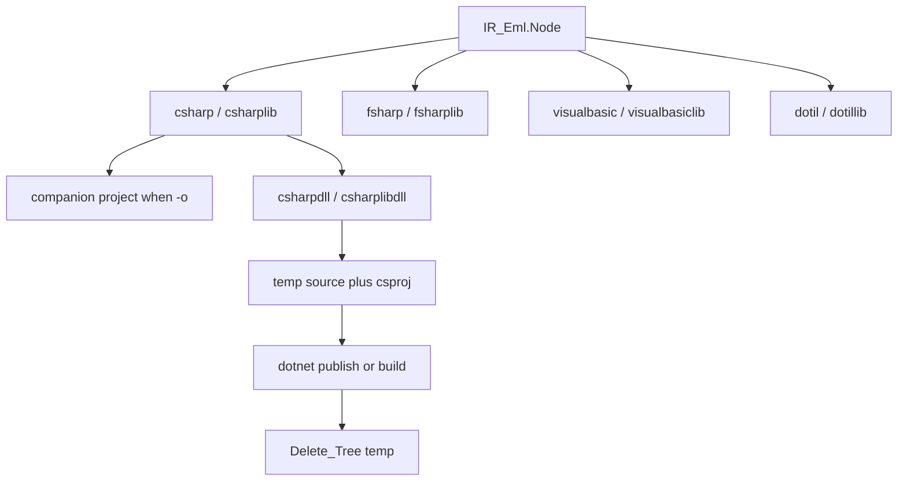

# Compile .NET C#, F#, VB, IL, and DLL backends

After this plan is accepted, create **`feature/compile-dotnet`** from **`main`** before any code. Do not implement on `main`. Keep this plan file under [`.cursor/plans/`](.cursor/plans/) (never delete). Wait for the user to request each numbered chunk.

## Locked product decisions

- **IR only.** Reuse [`Load_IR`](src/eml-cli.adb) and walk `IR_Eml.Node` (same nested `eml(...)` style as [`Js_Backend`](src/js_backend.ads) / [`C_Backend`](src/c_backend.ads)). No Flatten. No mxeml AST. Do not grow [`IR_Eml.Output_Format`](src/ir_eml.ads).
- **Remove `cli`.** Delete every “future `-of cli`” mention from rules/README/help. `-of cli` stays **unknown CLI** (same as today). Future unimplemented list becomes `bytecode`, `binary`, `wasm`, `wat` only.
- **No Alire crates.** Spawn the `dotnet` SDK via `GNAT.OS_Lib` for the two DLL formats only. Interpreter still does not need .NET.
- **Numerics:** `System.Numerics.Complex`; `eml(x, y) = Complex.Exp(x) - Complex.Log(y)`. Leaf `One_Node` is complex `1+0i`. Nested calls, not a stack loop.
- **Enclosing type:** C# / IL `public static class Eml`; F# `module Eml`; VB `Public Module EmlModule` (VB is case-insensitive, so a type named `Eml` cannot coexist with method `eml`).
- **Always public `eml`.** `--emit-eml` stays **clib-only**.
- **`--function-name` / `-fn`:** renames **`Compute`** (default `Compute`) on every new `-of` in this plan. Existing js (`main`) / clib (`compute`) unchanged. Reject `-fn` that is a case-insensitive match for `eml` or `Main` (clashes with the operator and program entry). Identifier rule stays letter/`_` then alnum/`_`.
- **`--framework <tfm>`:** space-separated only (no `=`); long form only (do not add `-f`; `-f` stays invalid). Repeated flag is invalid. Default **`net8.0`**. Lowercase required.
  - **Program TFMs** (`csharp`, `csharpdll`, `fsharp`, `visualbasic`, `dotil`): only `net` + digits + `.0` (e.g. `net8.0`, `net10.0`). Reject `netstandard*`, `net8.0-windows`, `netcoreapp3.1`, `NET8.0`.
  - **Library TFMs** (`csharplib`, `csharplibdll`, `fsharplib`, `visualbasiclib`, `dotillib`): program set plus **`netstandard2.0`** and **`netstandard2.1`** only.
  - Invalid on every other `-of` and every non-`compile` command.
- **`--no-companion-project`:** switch; repeated is invalid. Meaningful only for source formats that write a project beside `-o`: `csharp`, `csharplib`, `fsharp`, `fsharplib`, `visualbasic`, `visualbasiclib`. Invalid on DLL/IL/js/c/clib/eml/beml. Without `-o`, no project is written anyway (flag allowed, no extra effect).
- **Stdout (no `-o`):** **source only** for csharp/csharplib/fsharp/fsharplib/visualbasic/visualbasiclib/dotil/dotillib. **DLL formats require `-o`** (binary); dedicated diagnostic, then usage.
- **Companions when `-o` is set** (unless `--no-companion-project`): same directory and basename as the source (`out.cs` → `out.csproj`, `out.fs` → `out.fsproj`, `out.vb` → `out.vbproj`). SDK-style project with `EnableDefaultCompileItems` false and a single `Compile Include` of the simple source file name. `OutputType` `Exe` vs `Library`; `TargetFramework` from `--framework`.
- **DLL compile:** write the matching source+csproj into a unique temp directory, invoke `dotnet`, copy the artifact to `-o`, then **always** `Delete_Tree` the temp dir (success, `dotnet` missing, and build failure).
  - `csharpdll`: `dotnet publish -c Release --nologo -p:PublishSingleFile=true --self-contained false`; `-o` must end in **`.exe`**; copy the published apphost to `-o`.
  - `csharplibdll`: `dotnet build -c Release --nologo`; `-o` must end in **`.dll`**; copy the produced library DLL.
  - If `dotnet` is not on `PATH`: error diagnostic telling the user to install the SDK from [https://dotnet.microsoft.com/](https://dotnet.microsoft.com/). No output file.
  - If `dotnet` fails: diagnostic plus the child’s stderr; no output file; temp still deleted.
- **No F#/VB/IL DLL formats** and **no `ilasm` invocation** in this plan.
- **Print in program `Main`:** `Console.WriteLine` with `{real}{imag:+}i` (C `printf("%Lf%+Lfi")` analogue). F# `[<EntryPoint>] let main`; VB `Public Sub Main()`. Never rename `Main`/`main`.
- **Unknown spellings** stay invalid: `cli`, `cs`, `csharp-lib`, `vb`, `il`, `javascript`, …
- **Taylor / huge trees:** skip `*taylor*` in `run_samples` for these formats (same as js/c). Unit/CLI tests string-check sources; do not require `ilasm`. DLL happy-path CLI tests run **only if** `dotnet` is on `PATH`; otherwise assert the missing-SDK diagnostic when compiling a DLL format.

## Generated C# shape (program)

Header `// Source/Compiler/Version/Date` like JS. Static class `Eml` with `eml`, `Compute` (or `-fn`), and `Main` that assigns `z = Compute()` and prints. Library omits `Main`. Example `eml` body: `return Complex.Exp(x) - Complex.Log(y);`. Nested IR: `eml(new Complex(1, 0), new Complex(1, 0))` for `e`.

F# / VB / IL mirror that API (IL: `.entrypoint` only on `dotil`).

## CLI surface to extend

[`src/eml-cli.adb`](src/eml-cli.adb): grow local `Compile_Output_Format`; `Parse_Compile_Output_Format`; `Compile_Extension`; `Compile_Format_Image`; `Write_Compile_Output`; flag loop (`--framework`, `--no-companion-project`); post-parse validation next to `-fn` / `--emit-eml` (~2340); [`Put_Compile_Help`](src/eml-cli.adb) / `Put_Usage_Lines`.

[`src/eml-diagnostics.ads`](src/eml-diagnostics.ads) / [`.adb`](src/eml-diagnostics.adb): new IDs 33+ for repeated/invalid/not-allowed framework, missing `-o` for DLL, repeated/not-allowed `--no-companion-project`, `dotnet` missing, `dotnet` build failed. Update `CLI_Function_Name_Not_Allowed` text to include the new `-of` set.

`-o` extensions:

- `csharp` / `csharplib` → `.cs`
- `fsharp` / `fsharplib` → `.fs`
- `visualbasic` / `visualbasiclib` → `.vb`
- `dotil` / `dotillib` → `.il`
- `csharpdll` → `.exe`
- `csharplibdll` → `.dll`

## Docs (same change as the last code chunk, and pipeline mermaid in the same commit that first ships a new compile output)

Update [README.md](README.md) Pipelines mermaid (architecture rule: do not leave it stale), Compile subsection, layout table, `run_samples` compile paragraph.

Update [`.cursor/rules/eml-cli.mdc`](.cursor/rules/eml-cli.mdc), [`.cursor/rules/eml-backends.mdc`](.cursor/rules/eml-backends.mdc), [`.cursor/rules/eml-architecture.mdc`](.cursor/rules/eml-architecture.mdc) pipeline lines, [`.cursor/rules/eml-project.mdc`](.cursor/rules/eml-project.mdc) (replace “.NET CLI DLL” with these `-of` names). Strip `cli` from “future” lists; `$VARNAME` ABI note may still mention compiled binaries.

[`scripts/run_samples.ps1`](scripts/run_samples.ps1): non-taylor samples also compile `csharp`/`csharplib`/`fsharp`/`fsharplib`/`visualbasic`/`visualbasiclib`/`dotil`/`dotillib`; DLL formats only when `dotnet` exists.

## Out of scope

F#/VB/IL invoking `dotnet` or `ilasm`; NuGet; renaming `eml`/`Main`; `netX.0-windows` TFMs; VS Code C# highlighting; executing generated programs as a required unit test.

## Steps

### 1. C# source emitter and unit tests

New [`src/dotnet_backend.ads`](src/dotnet_backend.ads) / [`.adb`](src/dotnet_backend.adb) (or `csharp_backend`): `Format_CSharp_Program`, `Format_CSharp_Lib`, `Format_Csproj` (`Exe`/`Library` + TFM), companion path, write-to-file/stdout. Recursive `Format_Expr`. Default function name `Compute`.

New [`tests/dotnet_backend_tests.ads`](tests/dotnet_backend_tests.ads) / [`.adb`](tests/dotnet_backend_tests.adb); wire from [`tests/eml_tests.adb`](tests/eml_tests.adb).

**Tests:** `One` and `e` trees; program has `eml`, `Compute`, `Main`, `Complex.Exp`/`Log`, no Flatten opcodes; lib has no `Main`; renamed `-fn`; csproj `TargetFramework` and `OutputType`; companion path ends with `.csproj`.

### 2. CLI for csharp and csharplib plus new flags

Parse `--framework` / `--no-companion-project`; validate TFM by program vs library; default `net8.0`; allow `-fn` on these formats; stdout = C# only; with `-o` write `.cs` and `.csproj` unless `--no-companion-project`. Help/usage/diagnostics.

**Tests** in [`tests/cli_tests.adb`](tests/cli_tests.adb): happy mxeml/teml/eml/beml → csharp/csharplib; stdout has no `<Project`; `-o` writes companion; `--no-companion-project` writes only `.cs`; `-fn Eval`; `--framework net10.0` in csproj; negatives: `netstandard2.1` on csharp, `net8.0-windows`, repeated flags, `-of csharp -o x.js`, `--framework` on `js`/`run`, `--no-companion-project` on `c`, unbound/lex writes neither `.cs` nor `.csproj`; `-of cli` still unknown.

### 3. csharpdll and csharplibdll via `dotnet`

Temp dir + emit csharp/csharplib sources + spawn + copy + delete. Require `-o`. Locate `dotnet` on `PATH`. Missing SDK diagnostic includes https://dotnet.microsoft.com/ .

**Tests:** missing `-o`; extension mismatch (`.dll` on csharpdll, `.exe` on csharplibdll); `--no-companion-project` rejected; `-fn` accepted. If `dotnet` present: compile `e`, output file exists and non-empty, temp dir gone. If absent: DLL compile fails with the install-link diagnostic and no `-o` file.

### 4. F# and VB source/lib emitters plus CLI

Packages [`src/fsharp_backend.*`](src/fsharp_backend.ads) and [`src/vb_backend.*`](src/vb_backend.ads): same IR walk; F# `module Eml`, `let eml`, `let Compute`, `[<EntryPoint>] let main`; VB `Module EmlModule`. Companion `.fsproj` / `.vbproj`. CLI `-of fsharp|fsharplib|visualbasic|visualbasiclib`; extensions `.fs` / `.vb`; `--framework` / `--no-companion-project` / `-fn` same rules as csharp vs csharplib.

**Tests:** unit substring checks; CLI happy/negative (stdout source only; companion project; `netstandard2.0` allowed on `*lib` only; bad TFM).

### 5. IL emitters, docs, rules, samples

Package [`src/il_backend.*`](src/il_backend.ads): `dotil` with `.entrypoint` `Main`; `dotillib` without. Valid `ilasm` text: `.assembly extern` for `System.Runtime` / `System.Runtime.Numerics` / `System.Console` on `netX.0`, or `netstandard` on `netstandard2.0`/`2.1` (well-known public-key tokens). No project file. CLI `-of dotil|dotillib`, extension `.il`, `--framework` + `-fn`, reject `--no-companion-project`.

Then update README mermaid + Compile docs, `eml-cli` / `eml-backends` / `eml-architecture` / `eml-project` rules (remove `cli`), help/usage, [`scripts/run_samples.ps1`](scripts/run_samples.ps1), `alr build` + `./bin/eml_tests`.

**Tests:** IL has `eml`/`Compute` and `.entrypoint` only for `dotil`; stdout without `-o`; `--framework` in comments or extern version; CLI negatives; samples script covers the new source/IL formats (non-taylor).
