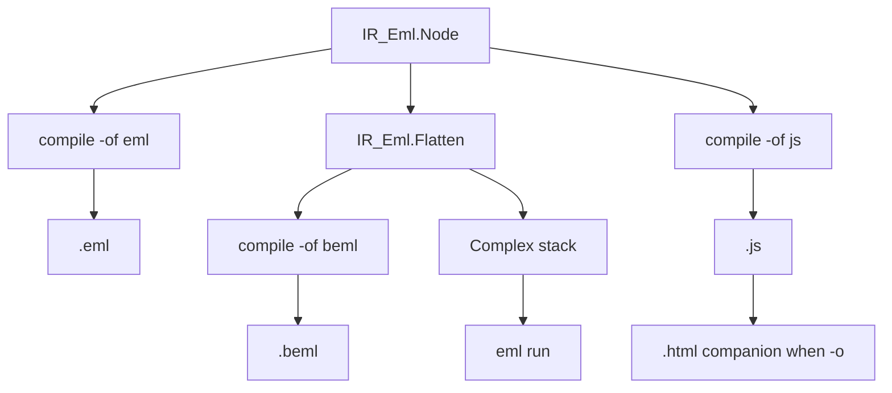

# Compile JavaScript backend

Current branch is **`main`**. Do not implement on `main`. After this plan is accepted, wait for a chunk request. Step 1 is creating **`feature/compile-js`** from `main` (permission required). Keep this plan file under [`.cursor/plans/`](.cursor/plans/) (never delete plan files).

The user said “elm”; this repo’s operator and function name is **`eml`**.

## Locked product decisions

- **New compile `-of`:** `js` (not `javascript`). Default compile format stays **`beml`**. Same-format rejection is unchanged (`eml`→`eml`, `beml`→`beml` only). `js` is never an input format, so `mxeml` / `teml` / `eml` / `beml` → `js` are all allowed.
- **Backend consumes IR only.** Reuse [`Load_IR`](src/eml-cli.adb) then walk `IR_Eml.Node`. Do **not** Flatten to a JS stack machine. Do **not** lower from the mxeml AST. Do not put JS emission in [`IR_Eml`](src/ir_eml.ads).
- **JS shape** (classic browser script, global `math` from math.js; no `import` / `require`):

```javascript
// Source: <path or <stdin>>
// Compiler: eml
// Version: <version>
// Date: YYYY-MM-DD HH:MM:SS UTC

function eml(x, y) {
  return math.subtract(math.exp(x), math.log(y));
}

function main() {
  return <nested-eml-expr>;
}
```

  - `One_Node` → `math.complex(1, 0)`
  - `Eml_Node` → `eml(<left>, <right>)` (nested, matching the IR tree)
  - `math.log` is natural log (math.js default), matching the paper
  - Do **not** call `main()` at top level in the `.js` file (the HTML page does)
  - Trailing newline, LF, 2-space indent (same header fields as `.eml`, `//` comments)
- **`-o` extension:** `-of js` requires `-o` to end in `.js` (existing `CLI_Output_Extension_Mismatch`).
- **Companion HTML** only when `-o` is set. Derive `foo.html` next to `foo.js` (same directory, same basename). `<script src>` uses the **simple filename** (`foo.js`), so the pair is openable from that folder. When `-o` is omitted, JS goes to **stdout** and **no HTML** is written (`<script src>` needs a file).
- **HTML** is a static viewer, not a compile `-of`. It loads a **pinned CDN** math.js browser bundle, then the generated JS, then writes `math.format(main())` into a body element:

```html
<!DOCTYPE html>
<html lang="en">
<head>
  <meta charset="utf-8">
  <title>EML</title>
  <script src="https://cdn.jsdelivr.net/npm/mathjs@14.5.2/lib/browser/math.js"></script>
  <script src="foo.js"></script>
</head>
<body>
  <pre id="result"></pre>
  <script>
    document.getElementById("result").textContent = math.format(main());
  </script>
</body>
</html>
```

  Pin `mathjs@14.5.2` as a named constant in the Ada package (tests assert that URL). Do **not** vendor math.js into the crate or copy it beside the output.
- **Out of scope:** Node `require`, ES modules, LLVM / .NET / JVM, VS Code, executing JS in Ada tests, runtime `$NAME:VALUE`. Huge Peano trees (`*taylor*` samples) may overflow JS parse/stack; skip them in the samples runner (same as `run`).



## Current code to reuse

- IR construction: [`Load_IR`](src/eml-cli.adb) / [`Run_Emlir`](src/eml-cli.adb). Extend [`Write_Compile_Output`](src/eml-cli.adb) (today only `Eml_Text` / `Beml_Binary`).
- CLI parse/help: [`Parse_Compile_Output_Format`](src/eml-cli.adb), [`Compile_Extension`](src/eml-cli.adb), [`Put_Compile_Help`](src/eml-cli.adb), [`Put_Usage_Lines`](src/eml-cli.adb). Introduce a CLI-local `Compile_Output_Format is (Eml_Text, Beml_Binary, Javascript)` rather than growing [`IR_Eml.Output_Format`](src/ir_eml.ads).
- File writes: same `Ada.Text_IO.Create` pattern as [`IR_Eml.Write_Eml_To_File`](src/ir_eml.adb). HTML path via `Ada.Directories` (`Containing_Directory` / `Base_Name` / `Compose` / `Simple_Name`).
- Tests: unit package like [`tests/ir_eml_tests.adb`](tests/ir_eml_tests.adb); CLI cases at the end of [`tests/cli_tests.adb`](tests/cli_tests.adb) (in-process, `--no-logo`; assert file contents, not stdout).

## Steps

### 1. Create branch feature/compile-js from main

Create `feature/compile-js` from `main` after permission. Do not implement on `main`. Commit this plan under [`.cursor/plans/`](.cursor/plans/) with the feature work (never delete plan files).

### 2. Js_Backend emitter and unit tests

New [`src/js_backend.ads`](src/js_backend.ads) / [`.adb`](src/js_backend.adb):

- `Mathjs_Script_Src` constant (pinned CDN URL above)
- `Format_Js (Root, Meta) return String` — header + `eml` + `main` as specified; recursive walk of `Left`/`Right`
- `Format_Html (Js_File_Name : String) return String` — companion page; `Js_File_Name` is the simple name used in `<script src>`
- `Companion_Html_Path (Js_Path : String) return String`
- `Write_Js_To_File` / `Write_Js_To_Stdout` / `Write_Html_To_File`

New [`tests/js_backend_tests.ads`](tests/js_backend_tests.ads) / [`.adb`](tests/js_backend_tests.adb) with `procedure Run (Failed : in out Boolean)`; wire from [`tests/eml_tests.adb`](tests/eml_tests.adb).

**Tests (emitter):**

- Happy: `One` → `main` contains `math.complex(1, 0)` and no `eml(` call in the return expr; `Make_Eml (Make_One, Make_One)` (`e`) → `return eml(math.complex(1, 0), math.complex(1, 0));`; nested `eml(eml(1,1), 1)` → nested `eml(eml(...), ...)`
- `eml` body is exactly `math.subtract(math.exp(x), math.log(y))`
- Header lines: `// Source:`, `// Compiler: eml`, `// Version:`, `// Date:` with `IR_Eml.UTC_Image`
- HTML: DOCTYPE, `Mathjs_Script_Src`, `<script src="out.js">`, `id="result"`, `math.format(main())`
- `Companion_Html_Path ("/tmp/foo.js")` ends with `foo.html`
- Negative: generated JS must not contain `require(`, `import `, or a top-level `main();` call

### 3. Wire compile -of js in the CLI

In [`src/eml-cli.adb`](src/eml-cli.adb) / help strings:

- Local `Compile_Output_Format` including `Javascript`; parse `"js"`; extension `.js`; image `js`
- [`Write_Compile_Output`](src/eml-cli.adb): on `Javascript`, write JS (`-o` or stdout); if `Has_Output`, also write companion HTML beside it
- Same-format check still only `Stack_Eml`+`Eml_Text` and `Beml`+`Beml_Binary`
- Update usage everywhere that lists compile `-of eml|beml` to `eml|beml|js` ([`Put_Usage_Lines`](src/eml-cli.adb), [`Put_Compile_Help`](src/eml-cli.adb)): mention companion `.html` when `-o` is set; stdout is JS only
- Example: `eml compile -i f.mxeml -of js -o out.js`

Front-end, `--var` / `--warn`, banner, and stop-with-no-output on preprocess/lex/parse errors stay as they are.

### 4. CLI tests, README, rules, build

Add cases in [`tests/cli_tests.adb`](tests/cli_tests.adb). Happy path: exit `0` and file contents. Negative: exit `1`, no JS/HTML files.

**Happy:** mxeml `e` `-of js -o …js` writes `.js` (has `function eml` / `function main` / nested `eml(`) and sibling `.html` (CDN + js basename + `main()`); teml `eml(1, 1)`; stack `.eml` `ONE`/`EML`; `.beml` produced by compile then `-of js`; `-v '$X=1'` on mxeml/teml; stdin `-if mxeml -of js` without `-o` succeeds (HTML not required).

**Negative:** `-of js -o out.eml` extension mismatch; `-of js` still rejects same-format only for eml/beml (not js); lex/parse/unbound still write **neither** `.js` nor `.html`; `-of javascript` and existing `-of cli` stay unknown.

Update:

- [`README.md`](README.md) **Pipelines** mermaid (add `writeJs` from `irNode`, not via Flatten) and **Compile** subsection (`-of js`, `.js` + companion `.html`, math.js CDN)
- [`.cursor/rules/eml-cli.mdc`](.cursor/rules/eml-cli.mdc) compile `-of eml|beml|js`, extension table, companion HTML rule, examples
- [`.cursor/rules/eml-backends.mdc`](.cursor/rules/eml-backends.mdc) JS target row; `-of` now includes `js`; future `cli` / `bytecode` / `binary` still later
- [`.cursor/rules/eml-architecture.mdc`](.cursor/rules/eml-architecture.mdc) pipeline one-liners: compile → `.eml` | `.beml` | `.js` (+ HTML companion)

Run `alr build` and `alr run -- eml_tests`. Zero warnings.

### 5. Add js to run_samples.ps1 compile coverage

Extend [`scripts/run_samples.ps1`](scripts/run_samples.ps1) `Invoke-CompileSamples`:

- Add `js` as a compile output for non-taylor **mxeml** and all **teml**, plus chained `.eml` / `.beml` → `js` (same skip as `run` for `*taylor*`)
- `-of js -o .results/compile/<base>.js`; require sibling `.html`
- Check (string, not executing JS): `.js` contains `function eml` and `function main`; `.html` contains `mathjs` and the `.js` basename
- Table `output format` includes `js`; header comment / README sample-runner layout mention `-of js`

## Tests (summary)

- **Emitter:** `1`, `e`, nested `eml`; header comments; HTML tags/CDN/`main()`; companion path; no `require`/`import`/top-level `main();`
- **CLI:** four input formats → `.js`+`.html`; `--var`; stdin JS-only; negative extension, unknown `-of javascript`, no files on lex/parse/unbound
- **run_samples:** non-taylor compile `-of js` writes both files with the required markers

## Out of scope

Node packaging, vendoring math.js, executing generated JS in tests, LLVM / .NET / JVM, VS Code, IR `$VAR` leaves, `$NAME:VALUE`.
