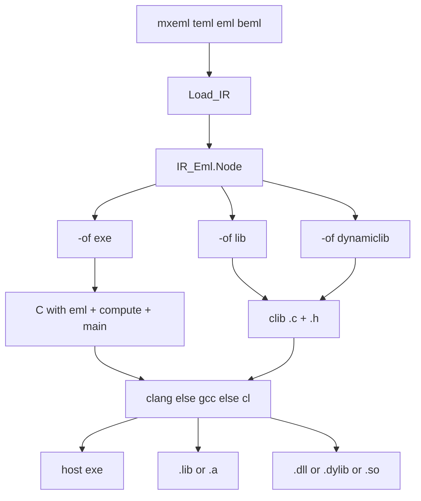

# Compile native C (`exe` / `lib` / `dynamiclib`)

Keep this plan under [`.cursor/plans/`](.cursor/plans/) (never delete plan files). Commit it with the feature work when committing.

Mirror the existing [`Dotnet_Build`](src/dotnet_build.ads) flow (temp dir, spawn, copy `-o`, always `Delete_Tree`), but drive **C** via [`C_Backend`](src/c_backend.ads) instead of `dotnet`.

## Locked product decisions

- **Three new compile `-of` values:** `exe`, `lib`, `dynamiclib`. Default compile format stays **`beml`**. Same-format rejection unchanged. All four inputs may compile to any of these. Spellings are exact lowercase (`Parse_Compile_Output_Format`).
- **IR only.** Reuse `Load_IR`; walk `IR_Eml.Node`. No Flatten. No mxeml AST.
- **Toolchain order:** `Locate_Exec_On_Path("clang")`, else `"gcc"`, else on Windows only `"cl"`. Do **not** use msbuild. If none found: diagnostic, no `-o` file, no temp dir.
- **`cl.exe` limitation (document, do not work around here):** generated C is C99 (`long double complex`, `cexpl` / `clogl`). MSVC often cannot compile that. Still invoke `cl` when it is the fallback; a non-zero exit is `CLI_C_Compile_Failed`. No second MSVC C dialect in this plan.
- **`-o` is required** for all three (reuse [`CLI_Dll_Requires_Output`](src/eml-diagnostics.ads) / id 38, same “binary output” wording).
- **`-fn` / `--function-name`:** allowed on `exe`, `lib`, and `dynamiclib`. Same identifier rules as today (letter/`_`, then alnum/`_`; reject case-insensitive `eml` / `Main`). Default entry is **`compute`** (C family, like clib — not .NET `Compute`).
  - **`exe`:** emit `static eml`, a named entry (`compute` or `-fn`), and `int main(void)` that calls the entry and prints with the same `printf` as [`Format_C_Program`](src/c_backend.adb). This is the csharpexe analog (`Compute` + `Main`). **`-of c` still rejects `-fn`** (source dump unchanged).
  - **`lib` / `dynamiclib`:** same as clib — rename the exported entry in `.c` and companion `.h`.
- **`--emit-eml`:** allowed on **`lib` and `dynamiclib`** (same as clib: non-static `eml`, prototype in `.h`). **Rejected on `exe`** (same as `-of c`).
- **`--framework` / `--no-companion-project`:** invalid on all three.
- **Companion `.h`:** write beside `-o` for `lib` and `dynamiclib` only (consumers need a C prototype). Same basename, `.h`. **No** header for `exe`. On compiler failure, write neither the binary nor the `.h`.
- **Windows `dynamiclib` exports:** temp clib used for DLL/dylib/so gets a portable export macro so `compute` (and `eml` iff `--emit-eml`) are exported on Windows. **`-of clib` source output stays unchanged** (no export macros).
- **Out of scope:** wasm/wat; rewriting C for MSVC; running the native binary inside Ada tests beyond a cheap exe smoke spawn when a compiler is present.

### `-o` extension (must match host)

| `-of` | Windows | macOS | Linux |
|---|---|---|---|
| `exe` | `.exe` (case-insensitive) | no extension | no extension |
| `lib` | `.lib` | `.a` | `.a` |
| `dynamiclib` | `.dll` | `.dylib` | `.so` |

Unix `exe` is the same rule as `csharpexe` (`Ada.Directories.Extension = ""`). Reuse `Dotnet_Build.Host_Is_Windows` for Windows; add Darwin vs Linux in the new package via `uname -s` (same pattern as [`dotnet_build.adb`](src/dotnet_build.adb)).

### Compiler command shapes (temp dir, then copy)

Flags: `-std=c11 -O2` for clang/gcc. Link `-lm` on non-Windows clang/gcc. Unix `exe`: `chmod +x` after copy (same as csharpexe).

- **exe + clang/gcc:** `cc -std=c11 -O2 -o <artifact> eml.c [-lm]`
- **exe + cl:** `cl /nologo /O2 /std:c11 /Fe:<artifact> eml.c`
- **lib + clang/gcc:** `cc -std=c11 -O2 -c -o eml.o eml.c` then `llvm-ar` else `ar` → `ar rcs <artifact> eml.o`. Missing archiver → compile-failed diagnostic.
- **lib + cl:** `cl /nologo /O2 /std:c11 /c eml.c` then `lib /nologo /out:<artifact> eml.obj` (`lib.exe` required).
- **dynamiclib + clang/gcc:** Linux ` -shared -fPIC -o …so`; macOS `-dynamiclib -o …dylib`; Windows clang/gcc `-shared -o …dll`.
- **dynamiclib + cl:** `cl /nologo /O2 /std:c11 /LD /Fe:<artifact> eml.c`

Temp parent: `TMPDIR` else `TEMP` else `TMP` else `/tmp`. Names `eml_cc_<N>`. Always delete the tree.

### New diagnostics (CLI 00041–00042)

- **00041** `CLI_C_Compiler_Not_Found` — `C compiler not found; install clang or gcc (or cl.exe on Windows)`
- **00042** `CLI_C_Compile_Failed` — `C compile failed: ` + exit text / missing archiver / missing artifact (same style as id 40)

## Current code to reuse

- [`C_Backend`](src/c_backend.ads): `Format_C_Lib` / `Format_C_Header` / `Write_C_Lib_*` for `lib`/`dynamiclib`; new exe formatter (do not change `-of c` text).
- [`Dotnet_Build`](src/dotnet_build.adb): temp dir, `Spawn`, `Delete_Tree`, `Locate_Exec_On_Path`, Unix chmod, `Host_Is_Windows` / exe path matcher — **copy the pattern into a new `C_Build` package**, do not make C depend on the .NET package except optionally calling `Host_Is_Windows` if that keeps duplication down. Prefer **no** `with Dotnet_Build` from `C_Build` (duplicate the tiny Windows check).
- CLI: extend local `Compile_Output_Format` in [`src/eml-cli.adb`](src/eml-cli.adb); `Compile_Fmt_Allows_Function_Name`; `Compile_Fmt` emit-eml allow-list (`C_Lib | Native_Lib | Native_Dynamiclib`); require `-o` like `Compile_Fmt_Requires_Dotnet`; `Write_Compile_Output` no-op for the three native formats (dispatch after `Load_IR` like csharpdll).
- GPR: [`eml.gpr`](eml.gpr) already uses `src/` — new units are picked up automatically.

## Steps

### 1. C_Backend extras and unit tests

- Add `Format_C_Exe_Program (Root, Meta, Function_Name)` — `static eml`, named entry returning the nested IR expr, `main` that prints. Default name `compute`.
- Add `Dll_Export` (default False) to `Format_C_Lib` / `Format_C_Header` / writers: when True, wrap exported functions in a small `EML_EXPORT` macro (`__declspec(dllexport)` on `_WIN32`, empty otherwise). Default path must keep today’s clib strings bit-for-bit (no macro).
- Tests in [`tests/c_backend_tests.adb`](tests/c_backend_tests.adb): exe source has `main`, named entry, `printf`, no export macro; `-fn eval`; `Dll_Export` true includes `EML_EXPORT` / `dllexport`; default lib still `static eml` and no `EML_EXPORT`.

**Tests:** happy `One` / `e` trees; negative not applicable at string level.

### 2. C_Build package and unit tests

New [`src/c_build.ads`](src/c_build.ads) / [`.adb`](src/c_build.adb):

- Host helpers: `Host_Is_Windows`, `Host_Is_Darwin`, expected suffixes, path matchers for exe/lib/dynamiclib.
- `C_Compiler_On_Path` / chosen-compiler image (`clang` / `gcc` / `cl`).
- `Build_Native_Exe` / `Build_Native_Lib` / `Build_Native_Dynamiclib` — write C (+ header text only used after success for lib/dyn) into temp, spawn, copy artifact to `-o`, write companion `.h` for lib/dyn, chmod Unix exe, always `Delete_Tree`.

New [`tests/c_build_tests.ads`](tests/c_build_tests.ads) / [`.adb`](tests/c_build_tests.adb); wire from [`tests/eml_tests.adb`](tests/eml_tests.adb).

**Tests:** suffix matchers (Windows vs Unix vs Darwin) without spawning; `C_Compiler_On_Path` is a boolean smoke (no fail if absent). Do not require clang/gcc/cl for these unit tests.

### 3. Wire compile `-of exe|lib|dynamiclib` in the CLI

[`src/eml-cli.adb`](src/eml-cli.adb), [`src/eml-diagnostics.ads`](src/eml-diagnostics.ads) / [`.adb`](src/eml-diagnostics.adb):

- Enum values, `Compile_Of_List`, parse, `Compile_Format_Image`, host-dependent `Compile_Extension` / path match (exe like csharpexe; lib/dynamiclib via `C_Build`).
- Allow `-fn` on the three; `--emit-eml` on lib/dynamiclib only; reject `--framework` / `--no-companion-project`.
- After `Load_IR`, if compiler missing → 00041; else `C_Build.*`; non-ok → 00042. No output file on failure.
- Help, error usage, examples (`-of exe -o out` / `out.exe`; `-of lib -o out.a`; `-of dynamiclib -o out.dylib`).

**Tests** (this step): none yet — CLI cases in step 4. (Implementation of parse/help only; keep the CLI test bundle in step 4 so numbering stays 1:1.)

Correction: eml-planning wants tests per step. Fold CLI tests into this step and make step 4 docs/samples only? Cleaner split:

Revise step 3 to include CLI tests, step 4 docs only.

**CLI tests** in [`tests/cli_tests.adb`](tests/cli_tests.adb):

- Negative: missing `-o`; wrong extension (flip host like `cli-compile-csharpexe-ext`); `-fn` reserved/`1bad`; `--emit-eml` with `exe`; `--framework` / `--no-companion-project`; `-of lib` no longer unknown.
- If no compiler: `-of exe -o …` → failure, diagnostic 00041, no output file.
- If compiler present: mxeml `e` → `exe` nonempty file (Windows `MZ` / Unix not `MZ`); `lib` nonempty; `dynamiclib` nonempty; sibling `.h` for lib/dyn with `compute`; `-fn eval --emit-eml` on lib; lex error writes no binary and no `.h`. Optional: spawn the `exe` and require exit 0.
- Skip `*taylor*` in samples (step 4), not here.

### 4. README, rules, run_samples

- [`README.md`](README.md) pipelines mermaid: three new compile edges from `irNode` (required by eml-architecture). Prose for toolchain order, extensions, `-fn` / `--emit-eml`.
- Rules: [`eml-cli.mdc`](.cursor/rules/eml-cli.mdc), [`eml-backends.mdc`](.cursor/rules/eml-backends.mdc), [`eml-architecture.mdc`](.cursor/rules/eml-architecture.mdc), [`eml-project.mdc`](.cursor/rules/eml-project.mdc) — `-of` lists, extension table, help usage line.
- [`scripts/run_samples.ps1`](scripts/run_samples.ps1): non-taylor mxeml + teml + chained eml/beml → `exe`/`lib`/`dynamiclib` **only when** a C compiler is on PATH (same gate as `Test-DotnetPresent`). Host-correct `-o` names.

**Tests:** sample script checks files exist; lib/dyn have companion `.h`; exe has no `.h`.

## What stays unchanged

- `-of c` / `-of clib` (except `--emit-eml` allow-list grows by lib/dynamiclib).
- .NET backends and `csharpexe`.
- Future `wasm` / `wat` remain unimplemented / unknown CLI.
