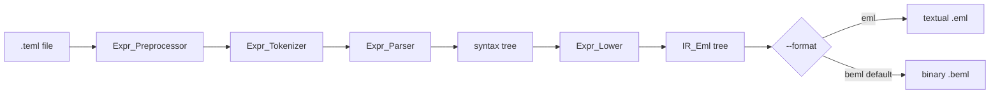

# EML IR command (`eml compile`, code name emlir)

## Context

[`IR_Eml`](src/ir_eml.ads) is a stub. [`Expr_Parser`](src/expr_parser.ads) already builds a syntax tree (`Number_Node`, `Constant_Node`, `UPlus_Node`, `UMinus_Node`, `Add_Node`, `Sub_Node`, `Mul_Node`, `Div_Node`, `Pow_Node`, `Call_Node`). [`eml parse`](src/eml-cli.adb) runs preprocessor → tokenize → parse and stops. There is no lowering and no `.eml` / `.beml` emitter.

The paper ([`docs/All elementary functions from a single operator.html`](docs/All%20elementary%20functions%20from%20a%20single%20operator.html)) defines `eml(x, y) = exp(x) - ln(y)` with constant `1`, an in-memory grammar `S → 1 | eml(S, S)`, and a **stack machine** whose RPN for `ln x` is `{1, 1, x, eml, 1, eml, eml}`. This feature lowers to that stack IR and emits it as text (`.eml`) or packed bits (`.beml`).

Current branch is **`main`**. Do not implement on `main`. After this plan is accepted, wait for a chunk request. Step 1 is creating **`feature/emlir`** from `main`.

## Locked product decisions

- **CLI command:** `eml compile` (subcommand of the existing `eml` executable, not a second binary).
- **Ada / code names stay emlir:** `Run_Emlir`, tests identifiers, branch `feature/emlir`, this plan filename. Do not rename packages to `compile`.
- **Native / .NET / JVM backends:** still unimplemented. This `compile` only supports `--format eml` and `--format beml`. Later `--format` values (`cli`, `bytecode`, `binary`) stay out of scope; unknown values are invalid CLI.
- **Input:** required `.teml` only (same as parse/tokenize). `.eml` / `.beml` input is invalid CLI.
- **Pipeline:** read file → preprocessor (`--var` / `--warn`) → tokenize → parse → lower AST to IR tree → encode as `eml` or `beml`. Stop with no output file on unbound/`--warn error`, lex, or parse errors (same gates as parse).
- **In-memory IR:** binary tree of `1` and `eml(S, S)` only. No `$VAR` (preprocessor already removed them).
- **Stack semantics:** `ONE` pushes `1`. `EML` pops `Y` then `X` and pushes `eml(X, Y) = exp(X) - ln(Y)`. Emit by **post-order** walk (left, right, `EML`), matching the paper’s `ln` RPN.
- **No extra opcodes** (no `DUP`, no `$VAR`). Repeated subtrees (e.g. `i` inside `sin`) are fully re-emitted. No algebraic simplification (out of scope).
- **`log` in `.teml`:** lowers as natural `ln`, matching the paper.
- **Constant `e`:** `eml(1, 1)`.
- **Constant `phi`:** `(1 + sqrt(5)) / 2` (same tree as [`samples/07_golden_ratio.teml`](samples/07_golden_ratio.teml)).
- **Unary `+`:** identity (emit the operand only).
- **Numeric literals:** exact rationals (see Numbers). Not an error to use `2`, `0.5`, `2.25`, `5040`.
- **Zero:** `1 - 1` via the subtraction rewrite (user table). Do not special-case the paper’s shorter `0 = ln(1)` (that is an optimization).
- **Identities:** use the rewrite table below as a **recursive macro expansion**. Paper Table 4 shorter RPNs are out of scope.
- **Timestamps:** always **UTC** in both `.eml` header `Date` and the BEML timestamp fields.



## `--format` / `-f`

Optional. Space-separated only (no `--format=`). Repeated `--format` is invalid CLI. Valid on **`compile` only** (`--format` / `-f` on preproc/tokenize/parse is invalid CLI). `-of` / `--output-format` stay parse-only and are invalid on `compile`.

- `beml` — **default** when the flag is omitted. Binary EML (see BEML).
- `eml` — textual stack dump (see `.eml` dump format).

When `-o` is present, the extension **must match** the selected format (same rule as parse):

- `eml` → `-o` ends in `.eml`
- `beml` → `-o` ends in `.beml`

Mismatch is invalid CLI. Without `-o`, the same format is written to stdout (banner still goes to stdout first unless `--no-logo`). For `beml`, pipes and tests must use `--no-logo` so the banner does not precede the binary.

## `.eml` dump format (`--format eml`)

Header (whole-line comments, then instructions; no blank lines):

```
-- Source: <path exactly as given to -i>
-- Compiler: eml
-- Version: <Eml.Info.Version>
-- Date: YYYY-MM-DD HH:MM:SS UTC
```

`Date` is **UTC**, not local time. Use `Ada.Calendar.Formatting` with `Time_Zone => 0`. `Format` takes a `Dump_Meta` record so tests inject a fixed UTC date.

Instruction lines:

- `ONE` optionally `  -- 1`
- `EML` optionally `  -- <tag>` where `<tag>` names the rewrite that created that node (`exp`, `ln`, `sub`, `zero`, `neg`, `add`, `mul`, `div`, `pow`, `sqrt`, `sinh`, `cosh`, `tanh`, `i`, `pi`, `phi`, `sin`, `cos`, `tan`, `e`)

Example for source `e`:

```
-- Source: e.teml
-- Compiler: eml
-- Version: 0.1.0-dev
-- Date: 2026-08-22 09:00:00 UTC
ONE  -- 1
ONE  -- 1
EML  -- e
```

A well-formed program is a binary tree: `#ONE = #EML + 1`, the stack never underflows, and it ends with one value.

## BEML dump format (`--format beml`, default)

Binary, write-only in this feature (no BEML reader yet). Comments and source path are **not** stored; only the instruction stream plus the header below.

Byte layout, in order. **Endianness: big-endian** (network byte order) for every multi-byte integer. Single-byte fields have no endianness. The README must state this explicitly (see README formats).

1. **Magic:** 4 bytes ASCII `BEML` (`42 45 4D 4C`).
2. **Format version:** 1 byte, currently `1`.
3. **UTC year:** 2 bytes, unsigned 16-bit **big-endian** (e.g. 2026 → `07 EA`).
4. **UTC month:** 1 byte (`1`–`12`).
5. **UTC day:** 1 byte (`1`–`31`).
6. **UTC hour:** 1 byte (`0`–`23`).
7. **UTC minute:** 1 byte (`0`–`59`).
8. **UTC second:** 1 byte (`0`–`59`; if a leap second `60` appears, store `59`).
9. **Instruction count:** 4 bytes, unsigned 32-bit **big-endian**, number of `ONE`/`EML` ops in post-order (not a byte count).
10. **Code:** packed bits, one bit per instruction in the same order as the textual dump (comments stripped).
    - Bit value `1` = `ONE`
    - Bit value `0` = `EML` (the request’s “EMP” is this opcode)
    - **Bit order:** most-significant bit first in each byte (bit 7 of the first code byte is the first instruction).
    - If the count is not a multiple of 8, **pad the remaining low bits of the last byte with `0`**. Those pad bits are not instructions; the count field is authoritative.

Example: program `ONE`, `ONE`, `EML` (count `3`) packs as one code byte `11000000` (binary).

Same `Dump_Meta` clock used for the `.eml` `Date` line fills the BEML timestamp so text and binary from one run agree.

Empty instruction stream is not expected from a successful parse of a real expression. Count `0` would still be a legal file (magic through count, no code bytes).

## Rewrite table (recursive)

Helpers (each returns an IR tree). `Eml(A, B, tag)` is the binary node. `One` is the leaf.

Foundational:

- `exp(X)` = `eml(X, 1)` — paper: `e^x = eml(x, 1)`
- `ln(Z)` = `eml(1, eml(eml(1, Z), 1))` — paper eq. (5)
- `sub(X, Y)` = `eml(ln(X), exp(Y))`
- `zero` = `sub(1, 1)`
- `neg(Y)` = `sub(zero, Y)`
- `add(X, Y)` = `sub(X, neg(Y))`
- `mul(X, Y)` = `exp(add(ln(X), ln(Y)))`
- `div(X, Y)` = `exp(sub(ln(X), ln(Y)))`
- `pow(X, Y)` = `exp(mul(Y, ln(X)))`

Advanced real:

- `sqrt(X)` = `exp(mul(div(1, add(1, 1)), ln(X)))`
- `sinh(X)` = `div(sub(exp(X), exp(neg(X))), add(1, 1))`
- `cosh(X)` = `div(add(exp(X), exp(neg(X))), add(1, 1))`
- `tanh(X)` = `div(sinh(X), cosh(X))`

Advanced complex:

- `i` = `sqrt(sub(zero, 1))`
- `pi` = `div(ln(sub(zero, 1)), i)`
- `cos(X)` = `div(add(exp(mul(i, X)), exp(neg(mul(i, X)))), add(1, 1))`
- `sin(X)` = `div(sub(exp(mul(i, X)), exp(neg(mul(i, X)))), mul(add(1, 1), i))`
- `tan(X)` = `div(sin(X), cos(X))`

AST mapping:

- `Number_Node` → Numbers (below)
- `Constant_Node` `e` / `i` / `pi` / `phi` → helpers above (`phi` = `div(add(1, sqrt(integer 5)), integer 2)`)
- `UPlus_Node` → lower `Left`
- `UMinus_Node` → `neg(Left)`
- `Add`/`Sub`/`Mul`/`Div`/`Pow` → corresponding helper
- `Call_Node` lexeme `log`/`sin`/`cos`/`tan`/`sqrt`/`sinh`/`cosh`/`tanh` → helper on `Left`

The paper notes a principal-branch sign issue for some `i` formulas. This compiler uses the table as written; no extra sign patch.

## Numbers

Parse the number lexeme as an **exact rational** `p / q` in lowest terms (Ada 2022 `Ada.Numerics.Big_Numbers.Big_Integers`):

- Integer `n` → `n / 1`
- Decimal `a.b` → concatenate digits over `10^(#fraction digits)`
- Scientific `m e k` → apply `10^k` to that rational
- Reduce by GCD

Then:

- `0` → `zero`
- `1` → `One`
- integer `n > 1` → left-associated `add(add(…, 1), 1)` (`n` copies of `1`)
- `p / q` with `q ≠ 1` → `div(integer(p), integer(q))` (`2.25` → `9/4`, `0.5` → `1/2`)

Negative literals do not exist as numbers; unary minus is `UMinus_Node`. Trees for `5040` (Taylor samples) will be large; that is accepted. No binary-exponent integer encoding in this feature.

## CLI

```
eml compile --input|-i <file.teml> [--output|-o <file>] [--format|-f eml|beml] [--var|-v $NAME=EXPR]... [--warn|-w default|none|error] [--no-color] [--no-logo]
```

- `-i` required, must end in `.teml`
- `-o` optional; extension must match `--format` (default `beml` → `.beml`); omit → stdout
- `--format` / `-f` optional; default `beml`; values `eml` or `beml`
- `--var` / `--warn` / `--no-color` / `--no-logo`: same as parse
- Flag order free; space-separated only
- `eml help compile` → usage on stdout, exit `0`
- Unknown help topic / unknown command lists include `compile` (not `emlir`)
- Usage on errors includes the `compile` line
- Exit `0` on success; `1` on invalid CLI, I/O, preprocess, lex, or parse errors
- Lowering does not introduce a new failure mode if parse succeeded (all AST kinds are covered)

Examples:

```
eml compile -i filename.teml
eml compile -i filename.teml -o other.beml
eml compile -i filename.teml -o other.eml -f eml
eml compile --no-logo -i f.teml -f eml
eml compile -i f.teml -v '$X=1' -w none -o out.beml
```

Wire `Run_Emlir` next to `Run_Parse` in [`src/eml-cli.adb`](src/eml-cli.adb). Dispatch when the subcommand string is `compile`. Reuse `Preprocess_And_Check`. Parse `-f` as its own flag so it is never treated as part of another option.

## Architecture (code)

New/replaced units:

- [`src/ir_eml.ads`](src/ir_eml.ads) / [`src/ir_eml.adb`](src/ir_eml.adb) — tree (`One` | `Eml` with `Left`, `Right`, `Comment`), constructors, post-order instruction list, `Format_Eml` (text) and `Format_Beml` (bytes). **Must not** depend on `Expr_Parser` (EML-text parser will lower here later).
- New [`src/expr_lower.ads`](src/expr_lower.ads) / [`src/expr_lower.adb`](src/expr_lower.adb) — `function Lower (Root : Expr_Parser.Node_Access) return IR_Eml.Node_Access`. Depends on parser + IR only.

Keep [`Expr_Parser`](src/expr_parser.ads) unchanged except callers. Do not grow `IR_Eml.Name` stub tests as the only coverage.

Write `.beml` as raw bytes (`Stream_IO` or equivalent), not `Text_IO`.

## Spec and docs (same commit as the matching step)

- [`.cursor/rules/eml-cli.mdc`](.cursor/rules/eml-cli.mdc): replace the placeholder `compile` examples with this command (`--format eml|beml`, default `beml`, `-o` extension rules, help). `Expected_Cmds` includes `compile`.
- [`.cursor/rules/eml-format.mdc`](.cursor/rules/eml-format.mdc): in-memory tree vs textual `.eml` (`ONE`/`EML`, comments, UTC header) vs BEML binary layout; stack pop order; **BEML multi-byte fields are big-endian**.
- [`.cursor/rules/eml-architecture.mdc`](.cursor/rules/eml-architecture.mdc): `.teml → … → parse → IR EML → .eml | .beml` via `eml compile`.
- [`.cursor/rules/eml-source-language.mdc`](.cursor/rules/eml-source-language.mdc): `log` is natural log when lowering; `phi` identity.
- [`.cursor/rules/eml-backends.mdc`](.cursor/rules/eml-backends.mdc): `eml compile --format eml|beml` writes stack IR; `cli` / `bytecode` / `binary` still later.
- [`README.md`](README.md): `compile` CLI section (command name `compile`, not `emlir`) **and** a dedicated **EML file formats** section that documents `.eml` and `.beml` in full (outline below). Do not leave format details only in `.cursor/rules`.

Keep the plan file under [`.cursor/plans/`](.cursor/plans/) (never delete).

### README formats (required content)

Add an **EML file formats** section to [`README.md`](README.md) (after `compile` CLI usage, before Samples). It must document both encodings so a reader does not need the plan or cursor rules.

**Textual `.eml` (`--format eml`):**

- Role: human-readable stack-machine IR.
- Header comments: `Source`, `Compiler`, `Version`, `Date` (`YYYY-MM-DD HH:MM:SS UTC`).
- Instruction lines: `ONE` and `EML` only, optional trailing `--` comments.
- Stack meaning: `ONE` pushes `1`; `EML` pops `Y` then `X` and pushes `eml(X, Y)`.
- Example (`e` → `ONE` / `ONE` / `EML`).

**Binary `.beml` (`--format beml`, default):**

- Role: compact packed-bit encoding of the same instruction stream (no comments, no source path).
- **Endianness: big-endian** for the 2-byte year and the 4-byte instruction count. State this in a sentence of its own, not only inside a field list.
- Field-by-field byte layout: magic `BEML`, version `1`, UTC year/month/day/hour/minute/second, instruction count, then code bits.
- Bit packing: `1` = `ONE`, `0` = `EML`; MSB-first in each byte; unused bits in the last byte padded with `0`; count is authoritative.
- Example: `ONE, ONE, EML` → count `3`, code byte `11000000`.

Step 12 writes this README content when wiring CLI/samples (step 2 still updates the cursor rules in parallel).

## Tests

**IR textual dump** ([`tests/ir_eml_tests.adb`](tests/ir_eml_tests.adb), from [`tests/eml_tests.adb`](tests/eml_tests.adb)):

- Happy: tree `eml(1, 1)` dumps `ONE` / `ONE` / `EML` in that order; header keys present; injected UTC date appears with a `UTC` suffix; trailing comments on `EML`.
- Stack: `#ONE = #EML + 1`; a tiny test helper interpreting `ONE`/`EML` as a dummy stack never underflows and ends at depth 1.

**BEML encoder** (same test package or [`tests/beml_tests.adb`](tests/beml_tests.adb)):

- Happy: `ONE, ONE, EML` → magic `BEML`, version `1`, injected UTC fields, count `3`, code byte `11000000`.
- Count not multiple of 8: pad bits are 0; count still matches the instruction list.
- Round-trip of bits (not a file parser): unpack bits using the locked MSB-first rule and recover the opcode sequence.
- Negative: do not require a BEML *reader* CLI; encoding tests only.

**Lowering** ([`tests/expr_lower_tests.adb`](tests/expr_lower_tests.adb)):

- Happy foundational: `1` → single `ONE`; `e` → three-instruction `e`; `log(1)` body matches paper RPN `1,1,1,EML,1,EML,EML`; `+1` equals `1`; `-1` is `neg(1)`; `1-1` uses `sub`; `1+1` / `1*1` / `1/1` / `1^1` produce only `ONE`/`EML` and a balanced stack.
- Numbers: `2` is `add(1,1)`; `0` is `zero`; `0.5` is `div(1,2)`; `2.25` is `div(9,4)`.
- Happy advanced: `sqrt(1)`, `sinh(1)`, `i`, `pi`, `phi` vs `(1+sqrt(5))/2` (same opcode sequence ignoring comments), `sin(1)`, `cos(1)`, `tan(1)`, `log(e)` structure uses `ln`/`exp` only.
- Negative: not a new parse error; unknown calls cannot appear after a successful parse. CLI covers front-end failures.

**CLI** ([`tests/cli_tests.adb`](tests/cli_tests.adb)):

- Happy: `compile -i f.teml -o g.beml` writes BEML magic (default format); `compile -i f.teml -o g.eml -f eml` writes header + `ONE`/`EML`; `--format beml`; `-f` alias; stdout `--no-logo -f eml`; `-v` / `-w none`; flag order; `eml help compile` exit 0.
- Negative: missing `-i`; input not `.teml`; `-o` `.eml` with default/`beml`; `-o` `.beml` with `-f eml`; `.eml` input; `--output-format` on `compile`; `--format` on `parse`; unknown `--format` value (including future `cli`); repeated `--format`; unbound `$X` → exit 1, no output file; lex/parse error → exit 1, no output file; unknown command list includes `compile` and does not require `emlir`.
- Text Date line matches `YYYY-MM-DD HH:MM:SS UTC`; do not hard-code wall-clock in golden dumps (strip or regex the Date line / BEML timestamp).

**Samples** ([`scripts/run_samples.ps1`](scripts/run_samples.ps1)): add operation `compile` writing default `.beml` under `.results/compile/` and `--format eml` `.eml` beside it, with the same dummy `--var` and `--warn none`.

**README** ([`README.md`](README.md), same step 12): `compile` usage plus the **EML file formats** section (textual `.eml` and binary `.beml`, including **big-endian** for BEML multi-byte fields). Update layout/test/samples mentions for `compile`.

Prove `alr build` and `alr run -- eml_tests` with **zero warnings**.

## Out of scope

- `--format cli` / `bytecode` / `binary` (LLVM, .NET, JVM)
- `eml run`, `.eml` / `.beml` tokenizer and parser (no BEML reader)
- Interpreter evaluation of IR (numeric checks)
- CSE, `DUP`, shorter paper RPNs, `0 = ln(1)`
- VS Code grammar for `ONE`/`EML`
- Runtime ABI for `$VAR` inside binaries
- Graphviz
