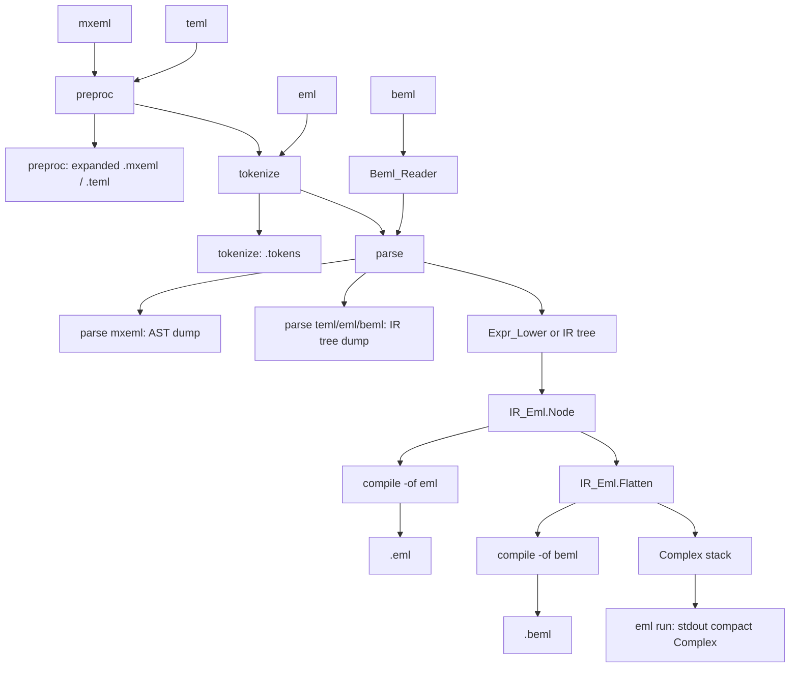

# eml run interpreter

Current branch is not the feature branch. Do not implement on `main`. After this plan is accepted, wait for a chunk request. Step 1 is creating **`feature/eml-run`** from `main` (permission required).

## Locked product decisions

- **Inputs:** all four formats (`mxeml`, `teml`, `eml`, `beml`). Effective format is `-if` when set, otherwise the extension. Stdin requires `-if` (same as parse/compile).
- **Front-end per format** (reuse compile, do not invent a second path):



  Command outputs (side nodes; `-o` optional except `run`):

  - **preproc** — expanded same-format text (`.mxeml` / `.teml` only). `eml` / `beml` have no preproc.
  - **tokenize** — `.tokens` from `mxeml` / `teml` / `eml`. `beml` has no tokenizer (reader only).
  - **parse** — tree dump (`.syntaxtree` / `.md` / `.dot` / `.svg`): **mxeml** is the expression AST; **teml** / **eml** / **beml** is the IR tree. Parse stops here; it does not Flatten.
  - **compile** — from `IR_Eml.Node`: `-of eml` writes `.eml` from the tree (tags kept); `-of beml` uses `Flatten` then packed bits. Same-format compile is rejected at the CLI (not drawn).
  - **run** — `Flatten` → complex stack → compact stdout (no file).

- **README diagram is canonical and must stay current.** The same mermaid lives in [`README.md`](README.md) under **Pipelines**. Add a workspace rule in [`.cursor/rules/eml-architecture.mdc`](.cursor/rules/eml-architecture.mdc) (Pipelines section): whenever preproc, tokenize, parse, compile, or run pipelines or their outputs change, update that README figure in the **same** change. Do not leave the diagram stale.

  - **mxeml:** preprocess → `Expr_Tokenizer` → `Expr_Parser` → `Expr_Lower.Lower`
  - **teml:** preprocess → `Teml_Tokenizer` → `Teml_Parser`
  - **eml:** `Eml_Tokenizer` → `Eml_Parser` (no preprocess)
  - **beml:** `Beml_Reader.Read_Bytes` → `Beml_Parser.Parse` (no preprocess)
  - Stop with no result on unbound `$VAR`, `--warn error` unused bindings, lex, parse, or I/O errors (same as compile).
- **Variables:** only via existing `--var` / `-v $NAME=EXPRESSION` and `--warn` / `-w` on **mxeml / teml** (preprocessor paste). On **eml / beml**, every `--var` is unused (same warn/error as compile). **`$NAME:VALUE` extras are out of scope** (still `CLI_Unexpected_Argument`). No IR variable leaves.
- **No `--output` / `-o` and no `--output-format` / `-of`.** Either flag on `run` is invalid CLI (dedicated diagnostic, then usage). `--format` / `-f` stays globally invalid.
- **Globals still allowed:** `--input` / `-i`, `--input-format` / `-if`, `--var` / `-v`, `--warn` / `-w`, `--no-color`, `--no-logo`.
- **Execution:** `Ops := IR_Eml.Flatten (Root)` then one opcode at a time on a stack of complexes. Rewrite tags are ignored.
  - `One` → push `1 + 0i`
  - `Eml` → pop `Y`, pop `X`, push `Exp(X) - Log(Y)` (principal branch)
  - After the last opcode, the stack must contain **exactly one** value: print it on **stdout** (never a file). Empty stack or leftover values → error, exit `1`.
  - Mid-run `Eml` with fewer than two values → error, exit `1` (defensive; well-formed IR from the parsers should not hit this).
- **Numerics:** instantiate `Ada.Numerics.Generic_Complex_Types` and `Ada.Numerics.Generic_Complex_Elementary_Functions` with **`Long_Float`**. Catch `Ada.Numerics.Argument_Error` and `Constraint_Error` from `Exp` / `Log` / arithmetic and emit a runtime diagnostic (e.g. `log(0)`).
- **Compact stdout format** (one line, `Put_Line`). Epsilon `Eps = 1.0E-12`. `Image_Of (X)` is `Long_Float'Image (X)` with the leading space stripped.

  - `Near_Zero (X)` = `abs(X) < Eps`
  - `Near_One (X)` = `abs(abs(X) - 1.0) < Eps`
  - Both parts near zero → `0`
  - Imag near zero → `Image_Of (Re)` only
  - Real near zero and imag near `+1` → `i`
  - Real near zero and imag near `-1` → `-i`
  - Real near zero otherwise → `Image_Of (Im) & " i"`
  - Both nonzero, `Im > 0` → `Image_Of (Re) & " + " & Image_Of (Im) & " i"`
  - Both nonzero, `Im < 0` → `Image_Of (Re) & " - " & Image_Of (abs (Im)) & " i"`

- **Runtime diagnostics** (new 00500 range) via `Eml.Diagnostics`, location `1:N` where `N` is the 1-based opcode index (or `0:0` if there is no current instruction). Suggested ids: `RT_Stack_Underflow` (500), `RT_Stack_Not_Single` (501), `RT_Numeric_Error` (502).
- **Samples runner:** [`scripts/run_samples.ps1`](scripts/run_samples.ps1) gains a `run` operation. Capture `eml run` stdout into a PowerShell variable (do **not** print that value). Parse it as a complex and require `|actual - expected| < 0.01` (modulus of the difference). Not a string compare.
- **Out of scope:** `$NAME:VALUE` runtime ABI, IR `$VAR` leaves, LLVM / .NET / JVM backends, VS Code.

## Current code to reuse

- Compile IR construction is [`Run_Emlir`](src/eml-cli.adb) (lines 1211–1356). Extract a shared `Load_IR` used by compile (then `Write_Compile_Output`) and run (then Flatten + Evaluate). Do not duplicate the four front-ends.
- Stack rules already exist in [`IR_Eml.Unflatten`](src/ir_eml.adb) (push `One`; `Eml` pops `Y` then `X`). The interpreter is the same walk over complexes instead of trees.
- [`src/interpreter.ads`](src/interpreter.ads) / [`.adb`](src/interpreter.adb) is a stub (`Name`). Grow this package. Replace the leftover `Interpreter.Name` check in [`tests/eml_tests.adb`](tests/eml_tests.adb) with `Interpreter_Tests.Run`.
- CLI today treats unknown `run` as `CLI_Unknown_Command` (15). Help still says `(run is not implemented yet)` ([`src/eml-cli.adb`](src/eml-cli.adb) line 140). Compile is a **fall-through** after preproc/tokenize/parse — `run` must get its own branch or it would compile.
- Next free CLI id is **26**. Next free diagnostic range after BEML 400s is **500**.

## Steps

### 1. Create branch feature/eml-run from main

Create `feature/eml-run` from `main` after permission. Do not implement on `main`. Keep this plan file under [`.cursor/plans/`](.cursor/plans/) (never delete plan files).

### 2. Interpreter complex types and compact Format_Complex

In [`src/interpreter.ads`](src/interpreter.ads) / [`.adb`](src/interpreter.adb):

- Instantiate `Generic_Complex_Types (Long_Float)` and `Generic_Complex_Elementary_Functions` on that instance. Add `pragma Elaborate_All` as needed so Alire `-gnatwe` stays clean.
- Export `subtype Complex` and `Format_Complex` implementing the compact rules above.
- Add [`tests/interpreter_tests.ads`](tests/interpreter_tests.ads) / [`.adb`](tests/interpreter_tests.adb) with `procedure Run (Failed : in out Boolean)` and wire it from [`tests/eml_tests.adb`](tests/eml_tests.adb). Drop the stub `Interpreter.Name` assertion.

**Tests (format):** `0+0i` → `0`; `1+0i` → `Image_Of (1.0)`; `0+1i` → `i`; `0-1i` → `-i`; `2+3i` and `2-3i` match the two-part templates; a value with `|Im| < Eps` omits the imag part.

### 3. Opcode stack Evaluate and runtime diagnostics

Add `RT_*` ids and messages in [`src/eml-diagnostics.ads`](src/eml-diagnostics.ads) / [`.adb`](src/eml-diagnostics.adb).

Add `Interpreter.Evaluate (Ops : IR_Eml.Opcode_Array)` (and an overload that `Flatten`s a `Node_Access`) returning success + `Complex`, or a structured error (`Id`, instruction index).

Algorithm (mirror [`IR_Eml.Unflatten`](src/ir_eml.adb) lines 93–123):

- Stack sized `Ops'Length` (or `Ops'Length + 1`).
- `One` → push `(1.0, 0.0)`.
- `Eml` → if `Top < 2` then `RT_Stack_Underflow`; else pop `Y`, pop `X`, push `Exp(X) - Log(Y)` inside an exception handler → `RT_Numeric_Error`.
- After the loop: `Top = 1` or `RT_Stack_Not_Single` (covers empty and leftover).

**Tests (evaluate):**

- Happy: `[One]` → `1`; `[One, One, Eml]` → `e` (`Exp(1)-Log(1)`); `Flatten (Expr_Lower.Lower (parse "e^(i*pi)+1"))` → near `0` (and `Format_Complex` → `0`); `i` → `i`.
- Negative: `[]` and `[One, One]` → `RT_Stack_Not_Single`; `[Eml]` and `[One, Eml]` → `RT_Stack_Underflow`; `log(0)` lowered to IR → `RT_Numeric_Error`.
- Compare Re/Im with a tolerance (e.g. `1.0E-10`), not bit-identical `e`.

### 4. Wire eml run CLI and shared IR load

In [`src/eml-cli.adb`](src/eml-cli.adb) / [`.ads`](src/eml-cli.ads) and diagnostics:

- Treat `run` as a known command. Update `CLI_Missing_Command`, `CLI_Missing_Command_With_Arg`, and `CLI_Unknown_Command` expected lists to include `run`.
- `Put_Usage_Lines`: add a `run` line **without** `-o` / `-of` (do not reuse `Common_Options` as-is).
- `Put_General_Help`: real `run` entry; remove `(run is not implemented yet)`.
- New `Put_Run_Help`; `eml help run` succeeds.
- New CLI ids **26** / **27**: `run does not accept --output/-o` and `run does not accept --output-format/-of`. After the command is `run`, if `Have_Output` or `Have_Output_Format` then `Fail_CLI` (before any read).
- `Input_Format_Allowed`: `run` allows all four (same as parse/compile). `Allowed_Extensions` already covers that via the `else` branch.
- Extract `Load_IR` from `Run_Emlir` (same `case In_Fmt`, same `Preprocess_And_Check` / lex / parse / lower). Compile keeps `Write_Compile_Output`. Run calls `Load_IR` → `Flatten` → `Evaluate` → `Put_Stdout (Format_Complex (Value))` on success; emit `RT_*` on failure. Banner still goes to stdout unless `--no-logo`.
- Do **not** fall through into the compile `-of` / same-format block.

Usage shape:

```
eml run [--input|-i <file>] [--input-format|-if mxeml|teml|eml|beml] [--var|-v $NAME=EXPR]... [--warn|-w default|none|error] [--no-color] [--no-logo]
```

Examples: `eml run -i filename.mxeml`; `eml run -i f.teml -v '$X=1'`; `eml --no-logo run -if eml < prog.eml`; `eml run -i f.beml`.

### 5. CLI tests, README, eml-cli.mdc, build

Add cases at the end of [`tests/cli_tests.adb`](tests/cli_tests.adb) (in-process `Eml.CLI.Run`, `--no-logo`). Happy path asserts **exit 0**; numeric text lives in `interpreter_tests` (CLI tests still do not capture stdout). Negative path: exit `1`.

**Happy:** mxeml `1` and `e`; teml `eml(1, 1)`; stack `.eml` `ONE` / `ONE`+`EML`; `.beml` produced by `compile` then `run`; mxeml/teml with `-v '$X=1'` (e.g. teml `eml($X, 1)`); stdin via existing `Run (Args, Stdin_Text)` / `Stdin_Data` + `-if`; `eml help run`.

**Negative:** `-o` / `-of` on `run`; missing `-i` and `-if`; lex/parse errors (no result); unbound `$X` on mxeml; unused `--var` on `.eml` with `-w error`; `$X:1` extra (unexpected argument); unknown extension.

Update [`README.md`](README.md): interpreter is no longer a stub; mention `eml run` (examples under the existing command list / a new `### Run` subsection: no `-o`/`-of`, `--var` on mxeml/teml). After **Input formats**, add a **Pipelines** section that embeds the combined mermaid above (same node ids and edges as this plan), including the preproc / tokenize / parse output nodes and the compile / run branches from `IR_Eml.Node`. One short paragraph under the figure (command stops vs Flatten).

In [`.cursor/rules/eml-architecture.mdc`](.cursor/rules/eml-architecture.mdc) **Pipelines**, add an always-apply rule: the README **Pipelines** mermaid is the picture of record for preproc, tokenize, parse, compile, and run; update it in the same change whenever those flows or outputs change. Also update [`.cursor/rules/eml-cli.mdc`](.cursor/rules/eml-cli.mdc) `run` section to match this surface (`--var` on mxeml/teml, no `-o`/`-of`, no `$NAME:VALUE` yet). Sample-runner README lines wait for step 6.

Run `alr build` and `alr run -- eml_tests`. Zero warnings.

### 6. Add run to run_samples.ps1 with numeric expected-value checks

Extend [`scripts/run_samples.ps1`](scripts/run_samples.ps1):

- Add `run` to `$AllOperations` (default when `-Operations` is omitted). Header comment and usage examples include `run`.
- New `Invoke-RunSamples`. Do **not** pass `-o` / `-of` (invalid on `run`). Do **not** write under `.results/run/`.
- Always invoke with `--no-logo --no-color` so stdout is only the compact complex line.
- **Capture, do not print:** assign native stdout to a PowerShell variable, e.g. `$RunOut = & $Eml --no-logo --no-color run -i $Path @SampleVarArgs`. Never `Write-Host` / `Write-Color` that string. The existing `[OK]` / `[FAIL]` table row stays (status only). On failure, `FailDetail` may say `distance … >= 0.01` or `exit N` — not the raw result.
- **Parse then compare numerically.** Helper `ConvertFrom-EmlComplex` understands the compact printer (`0`, `i`, `-i`, real-only `Image`, `Im i`, `Re + Im i`, `Re - Im i`). Parse each part with `[double]::Parse(..., InvariantCulture)`. Helper `Test-ComplexClose`: `|z| = sqrt((Re_a-Re_e)^2 + (Im_a-Im_e)^2) < 0.01`. **No string equality** on `$RunOut`.
- Dummy `--var` / `-w none` on mxeml/teml (same `$SampleVarArgs`). Chained `.eml` / `.beml` from `Ensure-ChainArtifacts` run with no `--var`.
- Skip `*taylor*` mxeml for `run` (same as chain): Peano-lowered literals such as `5040` make huge `exp`/`ln` trees; they are not a reliable 0.01 check. Still run every other mxeml, every teml, and the non-taylor chained `.eml` / `.beml` (same expected value as the source basename).
- Expected values live in a hashtable keyed by sample basename (`Re` / `Im`), computed from the math with the dummy bindings (`$X=$A=$B=$R=$M=$C=$THETA=1`). Not from a prior `eml run` string.

Expected (Im `0` unless noted):

- `01_trig_basics` — `sin(pi/4)+cos(pi/3)+tan(pi/6)` ≈ `1.784457`
- `02_hyperbolic` — `sinh(1)+cosh(1)+tanh(0.5)` ≈ `3.180399`
- `03_log_sqrt` — `2 + 1.5` = `3.5`
- `04_arithmetic_ops` — `23/7 + 64` ≈ `67.285714`
- `05_all_functions_mix` — `sin(1)+tanh(1) + i*cos(1)` ≈ `1.603065 + 0.540302 i`
- `06_euler_identity` — `0`
- `07_golden_ratio` — `(1+sqrt(5))/2` ≈ `1.618034`
- `10_harmonic_series` — `H_8` ≈ `2.717857`
- `11_pythagorean` — `sqrt(2)` ≈ `1.414214`
- `12_gaussian` — `exp(-1/2)/sqrt(2*pi)` ≈ `0.241971`
- `13_logistic_sigmoid` — `1/(1+e^(-1))` ≈ `0.731059`
- `14_circle_area` — `pi` ≈ `3.141593`
- `15_mass_energy` — `1`
- `16_precedence_add_mul` — `7`
- `17_precedence_parens` — `9`
- `18_precedence_power_right` — `512`
- `19_precedence_unary_power` — `-4`
- `20_precedence_mul_div_left` — `4`
- `21_precedence_add_mul_power` — `19`
- `22_precedence_mul_mix` — `23/7 + 8` ≈ `11.285714`
- `23_precedence_calls_and_ops` — `3`
- `24_precedence_unary_nested` — `15`
- `25_precedence_deep_parens` — `9`
- `t01_e` / `t02_exp_var` (`$X=1`) — `e` ≈ `2.718282`
- `t03_nested` — `exp(e)-ln(e)` = `e^e - 1` ≈ `14.154262`

Non-zero exit, unparsable stdout, or distance `>= 0.01` → `[FAIL]`. Table `output format` column: `stdout` (captured, not shown).

Update the README sample-runner examples (`-Operations …,run` and the layout row for `scripts/run_samples.ps1`).

## Tests (summary)

- **Format_Complex:** `0`, `i`, `-i`, real-only, `a + b i` / `a - b i`
- **Evaluate:** happy `1`, `e`, Euler ~ `0`, `i`; negative empty, leftover, underflow, `log(0)`
- **CLI:** four formats, `--var`, stdin `-if`, `help run`; negative `-o`/`-of`, bad payload, unbound, unused `--var` error, `$NAME:VALUE`
- **run_samples `run`:** each non-taylor sample (mxeml/teml and chained eml/beml) has `|z_got - z_exp| < 0.01`; result text is not printed

## Out of scope

`$NAME:VALUE` bindings, IR variable nodes, backends, VS Code.