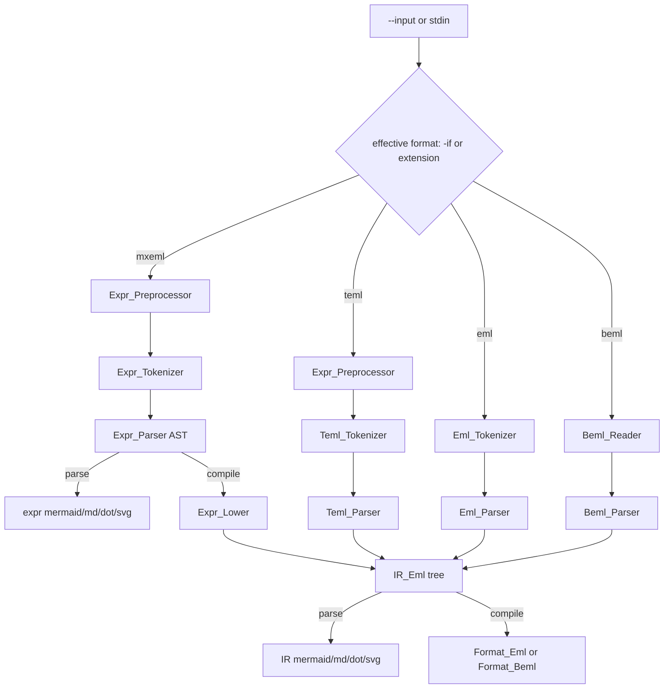

# Multi-format input, stdin, and diagnostic IDs

Current branch is **`main`**. Do not implement on `main`. After this plan is accepted, wait for a chunk request. Step 1 is creating **`feature/input-formats`** from `main` (permission required).

## Locked product decisions

Four **input formats** (`--input-format` / `-if`). File extension selects the format when `-if` is omitted. **`-if` always wins** over the extension.

- **`mxeml`** (`.mxeml`) — today’s math language (operators, `sin`/`log`/…, constants). **New:** binary call `eml(x, y)`. Preprocessor **on**. This is a rename of the current `.teml` language.
- **`teml`** (`.teml`) — nested tree text only: `1` and `eml(S, S)` (whitespace allowed). Preprocessor **on** (`$VAR` is pasted text, then the teml tokenizer runs). No `$VAR` tokens, no numbers other than `1`, no math operators.
- **`eml`** (`.eml`) — textual **stack IR** that `eml compile -of eml` already emits (`ONE` / `EML`, `--` comments). Preprocessor **off**; any `--var` is unused (same warning/error as unused mxeml bindings).
- **`beml`** (`.beml`) — packed-bit stack IR. Binary reader, not a tokenizer. Preprocessor **off**; unused `--var` as above.

**`--format` / `-f` is removed.** It is invalid CLI on every command (unexpected argument). Output format is always **`--output-format` / `-of`** (space-separated only; no `--output-format=`; repeated `-of` is invalid). Valid values depend on the command; omit `-of` to use that command’s default. When `-o` is present, the file extension **must match** the selected `-of` (same rule as today’s parse).

- **preproc** — `-of mxeml` | `teml`. Default = effective **input** format. `-o` (if present) must end in `.mxeml` or `.teml` accordingly. Mismatch with input format is invalid CLI (cannot preproc mxeml to `.teml` or the reverse).
- **tokenize** — `-of tokens` only. Default `tokens`. `-o` (if present) must end in `.tokens`.
- **parse** — `-of mermaid` | `md` | `dot` | `svg`. Default `mermaid`. `-o` extensions unchanged (`.syntaxtree` / `.md` / `.dot` / `.svg`).
- **compile** — `-of eml` | `beml`. Default `beml`. `-o` must end in `.eml` or `.beml`. Replaces today’s compile-only `--format` / `-f`.

Unknown `-of` value for the current command is invalid CLI (list the values legal for that command). `-of` on `help` is invalid CLI.

Same-format error is **compile-only**:

- effective input `eml` and `-of eml` → error, stop, no output
- effective input `beml` and `-of beml` → error, stop, no output (including default `-of beml` on a `.beml` input)
- `mxeml`/`teml` → either compile output is allowed
- `eml` → `beml` and `beml` → `eml` are conversions

Command × format:

- **preproc:** `mxeml`, `teml` only
- **tokenize:** `mxeml`, `teml`, `eml` (not `beml`)
- **parse / compile:** all four

Incorrect payload (bad tokens, bad magic, malformed stack, extra bytes, …) → diagnostic + exit 1, **no output file**. Lex errors on tokenize still dump valid tokens then fail (existing mxeml behavior). Parse/compile still stop before writing on lex/parse/format errors.

Do **not** rewrite historical plans under [`.cursor/plans/`](.cursor/plans/). Do **not** implement the VS Code extension in this feature; only update the workspace rules that name the languages.

## Diagnostics: `[ID] line:column description`

New Ada **child package** [`src/eml-diagnostics.ads`](src/eml-diagnostics.ads) / [`.adb`](src/eml-diagnostics.adb) (`Eml.Diagnostics`). Parent [`src/eml.ads`](src/eml.ads) stays `pragma Pure`.

- Every warning and error has a unique **5-digit** id (`00001`, `00002`, …) stored as named constants in that spec. No English diagnostic strings outside this package.
- Print exactly: `[00001] 1:8 undefined variable $X` (then optional ` (from $VAR)` for substituted text). Drop the current `error:` / `warning:` / `at line N, column M` prefixes.
- CLI / I/O diagnostics with no source location use **`0:0`**.
- BEML diagnostics use **line `1`** and **1-based byte offset** as column (header byte 1 is `1:1`).
- Color unchanged: red for errors, yellow for warnings, `--no-color` still disables. CLI errors still print usage + `Try 'eml help'…` after the diagnostic line(s).
- Severity lives next to the id so the CLI does not guess from the text.

Stable id bands (assign explicit constants; do not rely on enum `'Pos`):

- `00001`–`00099` — CLI (missing command, repeated flags, `-if`, `-of`, same-format compile, bad extension, command×format, …)
- `00100`–`00199` — preprocessor (unbound `$VAR`, unused `--var` warning, unused `--var` as error)
- `00200`–`00299` — tokenizers (mxeml / teml / stack eml)
- `00300`–`00399` — parsers (mxeml AST, nested teml, stack eml well-formedness)
- `00400`–`00499` — BEML reader/parser (magic, version, length, padding, stack)

Existing strings in [`src/eml-cli.adb`](src/eml-cli.adb), [`src/expr_tokenizer.adb`](src/expr_tokenizer.adb), [`src/expr_parser.adb`](src/expr_parser.adb) move into this catalog. Call sites pass parameters only.

## `--input` optional and `--input-format` / `-if`

In [`src/eml-cli.adb`](src/eml-cli.adb):

- `--input` / `-i` optional. If omitted, read **stdin** (text via the same newline-normalized path as `Read_File`; **beml** via raw bytes / `Stream_IO`, never `Text_IO`).
- `--input-format` / `-if` values: `mxeml`, `teml`, `eml`, `beml`. Space-separated only (no `--input-format=`). Repeated `-if` is invalid CLI.
- If `-i` is omitted, **`-if` is required**. If `-i` is present, `-if` is optional; when present it **overrides** the extension.
- Unknown extension without `-if` → error listing the extensions valid for that command.
- Tests inject stdin with `Run` overloads (text and `Stream_Element_Array`) so [`tests/cli_tests.adb`](tests/cli_tests.adb) does not depend on the process’s real stdin. Production `procedure Run` reads `Standard_Input`.
- Compile header `-- Source:` uses the `-i` path, or `<stdin>` when reading stdin.
- Preproc `-o` / `-of` must match the **effective** input format (`.mxeml` / `mxeml` or `.teml` / `teml`). `--format` / `-f` is rejected on all commands.

Help/usage/README and [`.cursor/rules/eml-cli.mdc`](.cursor/rules/eml-cli.mdc) (plus architecture, format, source-language, project, alias, vscode rules) are updated in the CLI step. [`scripts/run_samples.ps1`](scripts/run_samples.ps1) switches to `*.mxeml`.

## Front-ends (all produce `IR_Eml.Node` except mxeml parse, which still dumps the expression AST)

**mxeml `eml(x, y)`** — [`src/expr_tokenizer.ads`](src/expr_tokenizer.ads): add `Comma` / dump `COMMA`; treat `eml` as a function word. [`src/expr_parser.ads`](src/expr_parser.ads): `eml` is exactly two comma-separated expressions (`Call_Node` uses Left and Right; other calls stay unary). [`src/expr_lower.adb`](src/expr_lower.adb): `Make_Eml(Lower(Left), Lower(Right), Comment => "eml")`. Negative: `eml()`, `eml(x)`, `eml(x,y,z)`, top-level comma.

**Nested `.teml`** — new [`src/teml_tokenizer.ads`](src/teml_tokenizer.ads) / [`.adb`](src/teml_tokenizer.adb) using **`Regex_Automata`** (required). Tokens: `ONE` (`1`), `EML` (`eml`), `LPAREN`, `RPAREN`, `COMMA`. Skip whitespace; anything else is a lex error. New [`src/teml_parser.ads`](src/teml_parser.ads) / [`.adb`](src/teml_parser.adb): recursive descent `S → 1 | eml(S, S)`, first error wins, extra tokens error. Result is `IR_Eml.Node` (`One_Node` / `Eml_Node` with comment `"eml"`).

**Stack `.eml`** — replace stubs [`src/eml_tokenizer.ads`](src/eml_tokenizer.ads) / [`src/eml_parser.ads`](src/eml_parser.ads). Tokenizer uses **`Regex_Automata`**: skip whitespace and whole-line `--` comments; opcode `ONE` / `EML` (case-sensitive); trailing `  -- tag` on `EML` is captured as the token comment, not dumped. Parser is a stack walk: `ONE` pushes `Make_One`; `EML` pops **Y then X**, pushes `Make_Eml(X, Y, tag)`. Errors: unknown text, empty program, underflow, final depth ≠ 1. Header comments are optional (they are comments).

**`.beml`** — new [`src/beml_reader.ads`](src/beml_reader.ads) (header + bits → `IR_Eml.Opcode_Array`) and [`src/beml_parser.ads`](src/beml_parser.ads) (unflatten with the same stack rules). Add `Unflatten` on [`src/ir_eml.ads`](src/ir_eml.ads) so the walk is shared. Validate: magic `BEML`, version `1`, length = 16 + `ceil(count/8)` (extra or missing bytes error), pad bits **must be 0**, timestamp fields in range so `Time_Of` would succeed (even if compile output restamps “now”). Empty `count` is an error.

**Parse dumps for IR** — add mermaid/md/dot/svg on `IR_Eml` mirroring [`src/expr_parser.adb`](src/expr_parser.adb) (labels `1` and `eml`, comment appended when present). `eml parse` on mxeml keeps the expression AST dump; on teml/eml/beml it dumps the IR tree. Parse `-of` / `-o` extension rules unchanged (`mermaid` → `.syntaxtree`, …).

Remove the stub `Name` smoke checks in [`tests/eml_tests.adb`](tests/eml_tests.adb) once those packages are real; register new unit suites there.

## Tests (per step)

Happy and negative for each front-end and for CLI matrix: stdin without `-if`; `-if` overriding a misleading extension; unused `--var` on eml/beml; same-format compile (`-of eml` on `.eml` input, default `-of beml` on `.beml` input); `--format` / `-f` rejected; compile uses `-of eml` | `beml` (not `-f`); tokenize `-of tokens`; preproc `-of` must match input; unknown `-of` per command; bad magic / bad `ONE` text / `eml(1)`; round-trip `mxeml → eml → beml` and `teml → eml` producing equivalent flatten sequences; tokenize `.eml` dump lines; parse IR mermaid contains `1` / `eml`; diagnostic lines match `\[\d{5}\] \d+:\d+ `.

## Implementation notes

- Binary I/O for `.beml` files and stdin must not go through `Ada.Text_IO.Get_Line`.
- Nested `.teml` is **not** the stack language; `ONE`/`EML` inside a `.teml` file is a lex/parse error.
- Paper `$VARNAME` IR leaves stay out of scope: after a successful preprocess, IR is still only `1` and `eml(S,S)`.
- Keep Ada names `Run_Emlir` for the compile runner; add dispatch by input format inside it.
- One CLI parser branch for `--output-format` / `-of` (do not special-case `-of` as parse-only). After the command is known, map the value with a per-command table. Existing tests that pass `--format` / `-f` to compile must switch to `-of`; existing tests that assert `--format` is invalid on parse stay valid (the flag no longer exists at all).
