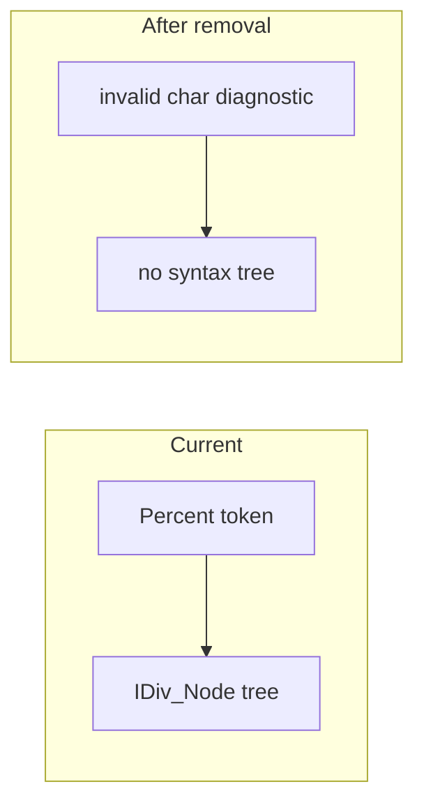

# Remove integer division (`%`) operator

## Context

Today the source expression language ([`.cursor/rules/eml-source-language.mdc`](.cursor/rules/eml-source-language.mdc)) defines `%` as **integer division** at the same precedence level as `*` and `/`. Implementation spans:

| Layer | Symbols |
|---|---|
| Tokenizer | `Expr_Tokenizer.Percent`, `Percent_Pat`, dump kind `PERCENT` |
| Parser | `Expr_Parser.IDiv_Node`, label `"%"` in tree dumps |
| Tests | Happy-path cases in [`tests/expr_tokenizer_tests.adb`](tests/expr_tokenizer_tests.adb) and [`tests/expr_parser_tests.adb`](tests/expr_parser_tests.adb) |
| Samples | [`samples/04_arithmetic_ops.teml`](samples/04_arithmetic_ops.teml), [`samples/22_precedence_idiv_mix.teml`](samples/22_precedence_idiv_mix.teml) |

No separate remainder operator exists. After removal, `%` falls through to the tokenizer’s existing invalid-character path (`unexpected character '%'`), and `eml parse` stops before building a tree (lex errors block parse, per [`src/eml-cli.adb`](src/eml-cli.adb)).



**Branch:** You are on `main`. Before implementing, ask permission to create `feature/remove-idiv-percent` from `main` (per [`eml-planning`](.cursor/rules/eml-planning.mdc)). Do not implement on `main` unless instructed.

**Historical plans:** Do not edit existing files under [`.cursor/plans/`](.cursor/plans/) (audit trail). Add a new plan file when the work is committed.

---

## Step 1 — Update source-language rule

Edit [`.cursor/rules/eml-source-language.mdc`](.cursor/rules/eml-source-language.mdc):

- Remove the `%` row from the operators table.
- Change the Mul precedence row from `` `*` `/` `%` `` to `` `*` `/` ``.
- Leave all other operators, functions, and precedence levels unchanged.

---

## Step 2 — Remove `%` from the expression tokenizer

In [`src/expr_tokenizer.ads`](src/expr_tokenizer.ads) and [`src/expr_tokenizer.adb`](src/expr_tokenizer.adb):

- Delete `Percent` from `Token_Kind`.
- Remove `Percent_Pat`, the `when Percent` arm in `Kind_Name`, and the `elsif Match (Percent_Pat, …)` emit branch.

No replacement token is needed; `%` becomes an invalid character automatically via the existing `else` diagnostic path in the scan loop.

---

## Step 3 — Remove integer division from the expression parser

In [`src/expr_parser.ads`](src/expr_parser.ads) and [`src/expr_parser.adb`](src/expr_parser.adb):

- Delete `IDiv_Node` from `Node_Kind`.
- Remove all `Percent` / `IDiv_Node` handling in `Node_Label`, `Lbp`, and `Binary_Kind`.
- Update the precedence comment from `mul/div/%` to `mul/div`.

Tree dump formatters (`Format_Mermaid`, `Format_Dot`, etc.) need no separate change—they route through `Node_Label`, which drops the `%` case with `IDiv_Node`.

---

## Step 4 — Update unit tests

### [`tests/expr_tokenizer_tests.adb`](tests/expr_tokenizer_tests.adb)

- **Remove** the happy-path block that tokenizes `"2%3"` and expects `Percent`.
- **Add** negative test: `Tokenize ("2%3")` → `Had_Errors = True`, exactly one valid token (`NUMBER "2"`), diagnostic mentions `%` at line 1 column 2.

### [`tests/expr_parser_tests.adb`](tests/expr_parser_tests.adb)

- **Remove** the happy-path block that parses `"2%3"` into `IDiv_Node`.
- **Add** negative test: `Parse_Source ("2%3")` → `Had_Error = True`, `Root = null` (lex error stops parse).

No CLI test changes are required (`cli_tests.adb` has no `%`-specific cases).

---

## Step 5 — Update samples and regenerate `.results`

### Samples

- [`samples/04_arithmetic_ops.teml`](samples/04_arithmetic_ops.teml): replace `%` with `/` so the expression stays a valid arithmetic mix, e.g. `(3 + 4 * 5) / 7 + 2^8 / 4`.
- [`samples/22_precedence_idiv_mix.teml`](samples/22_precedence_idiv_mix.teml): repurpose to a mul/div/power precedence sample without `%` (e.g. `(3 + 4 * 5) / 7 + 2 ^ 3`) and **rename** to `22_precedence_mul_mix.teml` so the filename no longer references idiv.

### Golden outputs

Regenerate affected artifacts under [`.results/`](.results/) by running:

```powershell
alire build
pwsh -File scripts/run_samples.ps1 -Operations tokenize,parse
```

Commit updated `.results` for samples `04_*` and `22_*` (old `22_precedence_idiv_mix.*` outputs removed; new `22_precedence_mul_mix.*` added).

---

## Step 6 — Build and run full test suite

```powershell
alire build
alire run -- eml_tests
alire run -- cli_tests
```

All binaries must compile with zero warnings (strict GNAT switches per [`eml-build`](.cursor/rules/eml-build.mdc)).

---

## Out of scope

- IR lowering, interpreter, and backends (no `IDiv` references exist there yet).
- VS Code TextMate grammar (extension not implemented).
- Editing historical plan files ([`telm_parse_cli_722144e8.plan.md`](.cursor/plans/telm_parse_cli_722144e8.plan.md), etc.).

---

## Test summary

| Case | Expected |
|---|---|
| Tokenize `1+2*3` | Unchanged; exit 0 |
| Tokenize `2%3` | Invalid token at `%`; exit 1 |
| Parse `2%3` | Lex error; no tree; exit 1 |
| Sample `04_arithmetic_ops.teml` | Tokenize + parse all four formats succeed |
| Sample `22_precedence_mul_mix.teml` | Tokenize + parse all four formats succeed |
| Full `eml_tests` + `cli_tests` | All pass |
