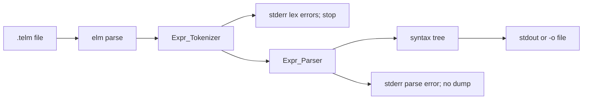

# TELM parser and parse CLI

## Context

Tokenize is complete on [`main`](src/elm-cli.adb). [`Expr_Parser`](src/expr_parser.ads) is still a stub (`Name`). Architecture requires: tokens → parser → syntax tree; `elm parse` stops at the tree (no IR / compile / run). Current branch is **`main`**. Do not implement on `main`. After this plan is accepted, create **`feature/telm-parse`** from `main` before any code (step 1). Wait for the user to request each chunk.

## Scope

**In scope**

- Expression AST and a precedence-climbing parser over [`Expr_Tokenizer`](src/expr_tokenizer.ads) tokens
- `elm parse`: tokenize the `.telm` file, then parse; dump the tree
- Same CLI conventions as tokenize: required `-i`/`--input`, optional `-o`/`--output`, free flag order, space-separated flags only, `--no-color`, `--no-logo`, stdout banner, `--no-logo` for pure dumps
- `--output-format` / `-of`: `mermaid` (default), `md`, `dot`, `svg`
- Precedence-focused samples plus parser/CLI tests (happy and negative)
- Rule and README updates

**Out of scope**

- `.elm` parse / `Elm_Parser` (still invalid CLI, matching tokenize)
- IR lowering, interpreter, backends, VS Code extension
- Implicit multiplication / juxtaposition
- Shelling out to Graphviz or adding crates (SVG is written by `elm` itself)



## Grammar and precedence (locked)

One expression per file (newlines are already skipped by the tokenizer). Parentheses change structure only; they are **not** tree nodes. `1+2*3` and `1+(2*3)` produce the same tree.

| Level | Forms | Associativity |
|---|---|---|
| Primary | number, constant, `$VAR`, `(e)`, `func(e)` | n/a |
| Unary | prefix `+` `-` | right |
| Power | `^` | right |
| Mul | `*` `/` `%` | left |
| Add | `+` `-` | left |

Consequences:

- `1+2*3` → add(1, mul(2, 3))
- `(1+2)*3` → mul(add(1, 2), 3)
- `2^3^2` → pow(2, pow(3, 2))
- `-2^2` → neg(pow(2, 2))  (power binds tighter than unary minus)
- `8/4*2` → mul(div(8, 4), 2)
- `sin(pi)+1` → add(call(sin, pi), 1)
- Functions take exactly one parenthesized argument; `sin 1` and `sin()` are parse errors
- Unary `+`/`-` after an operator is allowed (`1*-2`, `e^(-$X)` — already in [`samples/13_logistic_sigmoid.telm`](samples/13_logistic_sigmoid.telm))

Parser: Pratt / precedence climbing over the token array. Do not re-scan source.

## Syntax tree (locked)

Node kinds: leaf (`Number`, `Constant`, `Variable`), unary (`UPlus`, `UMinus`), binary (`Add`, `Sub`, `Mul`, `Div`, `IDiv`, `Pow`), `Call` (lexeme = function name, one child).

Keep source `Line`/`Column` from the operator, function, or leaf token. Binary nodes: left then right. Unary/`Call`: one child. Leaves: no children.

The dump is that tree (children evaluated before parent). No RPN side file.

## Output formats (locked)

`--output-format` / `-of` is optional; default **`mermaid`**. Repeat is invalid CLI. Space-separated only (`-of mermaid`, not `--output-format=`). Parse `-of` / `--output-format` as their own flags so `-of` is never treated as `-o`.

When `-o` is present, the extension **must match** the selected format. When `-o` is omitted, write that format to stdout (banner first unless `--no-logo`).

- `mermaid` → `-o` must end in `.syntaxtree` (or stdout). Raw Mermaid, no Markdown fence
- `md` → `-o` must end in `.md`. Markdown document wrapping the same Mermaid in a fenced block
- `dot` → `-o` must end in `.dot`. Graphviz `digraph`
- `svg` → `-o` must end in `.svg`. Self-drawn SVG (boxes + edges). No Graphviz

Mismatch (e.g. `-of mermaid -o t.md`, `-of svg -o t.syntaxtree`) is invalid CLI.

### Mermaid (also the body of `.syntaxtree`)

`flowchart TD`. Node ids `n1`, `n2`, … assigned in **preorder** (root first). Declare every node, then every edge, in that same walk (binary: left child then right). Quoted labels:

- Binary: `+` `-` `*` `/` `%` `^`
- Unary: `u+` `u-`
- Call / leaf: exact lexeme (`sin`, `1`, `pi`, `$X`)

Gold example, `1+2*3`:

```
flowchart TD
  n1["+"]
  n2["1"]
  n3["*"]
  n4["2"]
  n5["3"]
  n1 --> n2
  n1 --> n3
  n3 --> n4
  n3 --> n5
```

### Markdown

A `# Syntax tree` heading, a blank line, then a ` ```mermaid ` fence containing the same graph, then a closing fence. No extra commentary.

### DOT

```
digraph syntaxtree {
  n1 [label="+"];
  ...
  n1 -> n2;
  ...
}
```

Same ids, labels, and edge order as Mermaid.

### SVG

Deterministic top-down layout (parent above children, children left-to-right). XML-escape labels. Tests check the SVG root, escaped labels, and parent/child structure — not pixel-perfect coordinates if a later layout tweak is needed, but the emitter must be stable enough for golden checks on small trees.

## CLI (this plan)

Valid (flag order free after `parse`):

```
elm parse --input|-i <file.telm> [--output|-o <file>] [--output-format|-of mermaid|md|dot|svg] [--no-color] [--no-logo]
```

Pipeline in [`Run_Parse`](src/elm-cli.adb):

1. Read input (I/O failure → stderr, exit `1`, no usage block)
2. `Expr_Tokenizer.Tokenize`
3. If `Had_Errors`: print the existing lex diagnostics, **do not parse**, **do not write** a tree, exit `1`
4. `Expr_Parser.Parse` on the token array
5. If parse error: stderr diagnostic, **do not write** a tree, exit `1`
6. Emit the selected format to `-o` or stdout; exit `0`

Parse diagnostic (stop at the **first** error; unlike lex, do not recover):

```
error: parse error at line <line>, column <column>: <reason>
```

Reasons (plain English, quote the token when useful): `unexpected end of input`; `unexpected token '+'`; `expected ')'`; `expected '(' after function 'sin'`; `unexpected token after expression`. Empty file → parse error at 1:1.

Invalid CLI (stderr, red unless `--no-color`, usage + `Try 'elm help'`, exit `1`): missing/unknown command; missing `-i`; extra args; input not `.telm` (including `.elm`); unknown `-of` value; `-o` extension not matching format; repeated `-i`/`-o`/`-of`; `--input=` style.

`elm help parse` on stdout, exit `0`. General help lists `parse`. Missing-command / unknown-command text becomes `expected help, tokenize, or parse`. Usage block gains a parse line. `compile` / `run` stay unimplemented.

Update the existing CLI test that currently expects `elm parse` to fail as an unknown command.

## Samples

Keep 01–15. Add precedence / grouping samples (all must tokenize **and** parse):

- `16_precedence_add_mul.telm` — `1 + 2 * 3`
- `17_precedence_parens.telm` — `(1 + 2) * 3`
- `18_precedence_power_right.telm` — `2 ^ 3 ^ 2`
- `19_precedence_unary_power.telm` — `-2 ^ 2`
- `20_precedence_mul_div_left.telm` — `8 / 4 * 2`
- `21_precedence_add_mul_power.telm` — `1 + 2 * 3 ^ 2`
- `22_precedence_idiv_mix.telm` — `(3 + 4 * 5) % 7 + 2 ^ 3`
- `23_precedence_calls_and_ops.telm` — `sin(pi / 2) + cos(0) * 2`
- `24_precedence_unary_nested.telm` — `1 + -2 * -(3 + 4)`
- `25_precedence_deep_parens.telm` — `((1 + 2) * (3 - 4)) ^ 2`

Extend [`scripts/run_samples.ps1`](scripts/run_samples.ps1) with `-Operation parse`. For each sample, run `elm parse` **once per format** (`mermaid`, `md`, `dot`, `svg`) with matching `-of` and `-o` extensions. Write all four artifacts under `.results/parse/` using the sample basename:

- `01_trig_basics.syntaxtree` (`-of mermaid`)
- `01_trig_basics.md` (`-of md`)
- `01_trig_basics.dot` (`-of dot`)
- `01_trig_basics.svg` (`-of svg`)

A sample fails if **any** format run exits non-zero. Tokenize stays a single `.tokens` dump. Negative parse cases live in tests, not `samples/`. Document the four parse outputs in [`README.md`](README.md).

## Tests

No third-party test crates. Driver remains [`tests/elm_tests.adb`](tests/elm_tests.adb). Add `tests/expr_parser_tests.*`. Drop the `Expr_Parser.Name` stub assertion once real tests exist (keep `Name` if still useful).

**Parser** (tokenize then parse, or `Parse` on tokens):

- Happy: gold tree for `1+2*3` vs `(1+2)*3`; `2^3^2`; `-2^2`; `8/4*2`; `2%3`; `sin(pi+$X)`; `e^(-$X)`; nested calls; unary after operator
- Negative: empty input; trailing tokens `1+2 3`; unmatched `(` / `)`; `sin` without `(`; `sin()`; `+` as a binary missing operand; juxtaposition `2 pi`

**Emitters**

- Mermaid exact match for `1+2*3` and `(1+2)*3` (different graphs)
- `md` wraps that Mermaid; `dot` has the same ids/edges; `svg` contains an `svg` root and the labels `+`, `*`, `1`, `2`, `3`

**CLI**

- Happy: `-i`/`-o` mermaid `.syntaxtree`; long `--input`/`--output`/`--output-format`; `-of md|dot|svg` with matching extensions; no `-o` + `--no-logo` → dump on stdout; flag order; `elm help parse`
- Negative: `.elm` input; `-o` wrong extension for format; unknown `-of`; missing `-i`; lex error → no tree file / exit 1; parse error → no tree file / exit 1
- Update `cli-parse: exit` so a **valid** `parse` invocation succeeds

Prove `alr build` and `elm_tests` with **zero warnings/errors**.

## Layout (files to change)

- [`src/expr_parser.ads`](src/expr_parser.ads) / [`.adb`](src/expr_parser.adb) — AST, `Parse`, four emitters
- [`src/elm-cli.ads`](src/elm-cli.ads) / [`.adb`](src/elm-cli.adb) — `parse` command and help
- [`tests/expr_parser_tests.ads`](tests/expr_parser_tests.ads) / [`.adb`](tests/expr_parser_tests.adb), [`tests/cli_tests.adb`](tests/cli_tests.adb), [`tests/elm_tests.adb`](tests/elm_tests.adb)
- [`samples/16_*.telm`](samples/) … `25_*.telm`; [`scripts/run_samples.ps1`](scripts/run_samples.ps1); [`README.md`](README.md)
- [`.cursor/rules/elm-cli.mdc`](.cursor/rules/elm-cli.mdc), [`elm-source-language.mdc`](.cursor/rules/elm-source-language.mdc) (precedence table)

Do not flesh out `elm_parser`, IR, interpreter, or backends.

## Steps (1:1 with TODOs)

1. Create branch `feature/telm-parse` from `main`
2. Update CLI and source-language rules for parse, precedence, and output formats
3. Implement `.telm` syntax-tree types and precedence-climbing parser
4. Add parser tests (precedence happy path and parse errors)
5. Implement mermaid, markdown, DOT, and SVG emitters
6. Add emitter tests
7. Implement `elm parse` CLI (tokenize then parse, `-i`/`-o`/`-of`, help, errors)
8. Add parse CLI tests, precedence samples, sample-runner/README updates; prove `alr build` and tests pass with zero warnings
