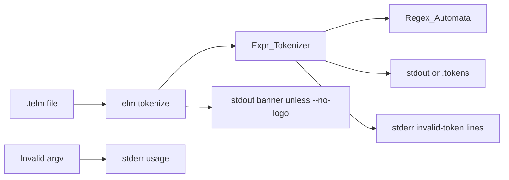

# TELM tokenizer and tokenize CLI

## Context

The crate is stubs only ([`src/expr_tokenizer.ads`](src/expr_tokenizer.ads), [`src/regex_automata.ads`](src/regex_automata.ads), [`src/elm-cli.adb`](src/elm-cli.adb)). Architecture requires tokenizers to use the **in-repo regex automata library**, not an ad-hoc scanner. This plan therefore implements a usable regex engine **as a dependency of the tokenizer**, not as a leftover stub.

Current git branch is **`main`**. Do not implement on `main`. After this plan is accepted, create **`feature/telm-tokenizer`** from `main` before any code (step 1). Wait for the user to request each chunk.

## Scope

**In scope**

- Regex automata library: compile a regex subset to an automaton and match prefixes
- `.telm` tokenizer (`Expr_Tokenizer`) using that library
- `elm tokenize` with required input and **optional** output (file or stdout)
- Short flags `-i` / `-o` alongside `--input` / `--output`
- Optional compiler CLI flags `--no-color` (disables ANSI color on diagnostics) and `--no-logo` (suppresses the startup banner); neither is an Alire/GNAT switch
- Startup banner on **stdout** (name, author, version, git commit), never in the `--output` file
- Invalid CLI: usage on stderr (red unless `--no-color`), exit `1`
- Lex errors: human-readable stderr diagnostic, **continue** scanning, still emit valid tokens, exit `1` if any invalid token was seen (`0` on full success)
- Language: `sinh`, `cosh`, `tanh` (same class as `sin` / `cos` / `tan`)
- Rule updates and tests (happy + negative)

**Out of scope**

- `.elm` tokenizer, both parsers, IR lowering, interpreter, backends, VS Code extension
- Implicit multiplication / juxtaposition
- `parse` / `compile` / `run` (invalid CLI for this plan → usage)
- Color on the token dump itself (tokens are always plain text)
- Banner on `elm_tests` (only the `elm` executable prints it)

## Token dump format (locked)

When `--output`/`-o` is given, write a UTF-8 `.tokens` file. When it is omitted, write the same dump to **stdout**. One token per line, no header, no EOF token, no skipped whitespace:

```
<line>:<column> <KIND> <lexeme>
```

- `line` / `column` are **1-based**, pointing at the first character of the lexeme
- `KIND` is a stable uppercase name (not Ada `Image`)
- `lexeme` is the exact source text (variables include the `$`)
- Invalid tokens are **not** written to the dump; they are reported on stderr only
- The startup banner is **never** written into the `--output` `.tokens` file
- When `-o` is omitted, stdout is banner (unless `--no-logo`) then the token dump; use `--no-logo` when a pure dump on stdout is required (pipes, tests)

Kinds:

- Operators: `PLUS` `MINUS` `STAR` `SLASH` `PERCENT` `CARET`
- Punctuation: `LPAREN` `RPAREN`
- `NUMBER` — decimal and scientific (`3`, `3.14`, `1.2e-3`, `1.2E+3`)
- `FUNCTION` — `log` `sin` `cos` `tan` `sqrt` `sinh` `cosh` `tanh`
- `CONSTANT` — `i` `pi` `e` `phi`
- `VARIABLE` — `$VARNAME` with `VARNAME` = `[A-Za-z_][A-Za-z0-9_]*`

Example for `sin(pi+$X)`:

```
1:1 FUNCTION sin
1:4 LPAREN (
1:5 CONSTANT pi
1:7 PLUS +
1:8 VARIABLE $X
1:10 RPAREN )
```

## `.telm` lexing rules

- Skip `[ \t\n\r]+` (not emitted)
- Longest match; operators are single character
- Letter-runs `[A-Za-z]+` are classified as `FUNCTION` or `CONSTANT`; any other word (`foo`, `log10`, `tanH`) is an **invalid token** (so `tan` vs `tanh` is a whole-word classify, not a prefix)
- Numbers: `[0-9]+(\.[0-9]+)?([eE][+-]?[0-9]+)?` (no leading-dot `.5`)
- Unknown characters (`@`, `,`, `#`) are invalid tokens
- Case-sensitive: only lowercase function/constant names
- Empty file → empty dump, exit `0` (parser will reject later)
- Unary `+`/`-` are just `PLUS`/`MINUS`

### Invalid tokens: report and continue

Do **not** stop at the first bad token. For each invalid token:

1. Write a human-readable diagnostic to **stderr** (never mix it into the token dump)
2. Skip that token and resume at the next character (unknown word: skip the whole letter-run; unknown character: skip that one character)
3. Keep emitting subsequent **valid** tokens to stdout or `--output`

Diagnostic format (locked, one line per error):

```
error: invalid token at line <line>, column <column>: <reason>
```

Reasons (plain English, include the offending text in quotes when it helps):

- `unexpected character '@'`
- `unknown identifier 'foo'`
- `unknown identifier 'log10'`

Example: input `1+@2 foo` still dumps `NUMBER 1`, `PLUS +`, `NUMBER 2`, and prints two stderr errors. Exit code is `1`.

If at least one invalid token was found, the process exit status is **`1`**. If the file tokenized with no invalid tokens, exit **`0`**. (Invalid CLI and I/O failures also use `1`; they are not “success”.)

## Regex automata (needed by the tokenizer)

Expand [`src/regex_automata.ads`](src/regex_automata.ads) / [`.adb`](src/regex_automata.adb). Tokenizers call this library only.

Supported regex subset (no backreferences, no lookahead):

- Literals, concatenation, `|`, greedy `*` `+` `?`, `(...)`
- Character classes `[abc]`, ranges `[0-9]`, negation `[^0-9]`
- Escapes: `\\` `\|` `\(` `\)` `\+` `\*` `\?` `\[` `\]` and `\.` as a literal dot

API (shape, names may match Ada style):

- `function Compile (Pattern : String) return Engine;`
- `function Match_Prefix (E : Engine; Input : String; From : Positive) return Natural;` — match length from `From`, or `0`
- Invalid pattern: `Regex_Error` exception

Implementation: parse regex to a small AST, **Thompson NFA**, simulate with epsilon-closure; prefix match records the last accepting length. Tokenizer compiles patterns once (elaboration or first use) for whitespace, number, word, variable, and each operator.

Keyword classification after a word match is a table lookup; that is not an ad-hoc scanner — the scan itself is regex.

## CLI (this plan)

Valid (flag order free after `tokenize`; space-separated only, no `--input=`):

```
elm tokenize --input <file.telm>
elm tokenize -i <file.telm>
elm tokenize --input <file.telm> --output <file.tokens>
elm tokenize -i <file.telm> -o <file.tokens>
elm tokenize --no-color -i <file.telm>
elm tokenize --no-logo -i <file.telm> -o <file.tokens>
```

- `--input` and `-i` are equivalent; **required**; value must end in `.telm`
- `--output` and `-o` are equivalent; **optional**; if present, value must end in `.tokens` and the dump is written there; if absent, the dump goes to **stdout**
- `--no-color` is an optional flag to **`elm` itself** (compiler CLI, not an Alire/GNAT compile switch). It takes no argument. When set, stderr diagnostics and usage are plain text. Default is ANSI red (`\e[31m...\e[0m`) on stderr. Token dump is never colored. Accept it **before or after** the subcommand, mixed with `-i`/`-o`
- `--no-logo` is an optional flag to **`elm` itself** (same class as `--no-color`). It takes no argument. When set, the startup banner is not printed. Accept it **before or after** the subcommand (`elm --no-logo tokenize -i f.telm` and `elm tokenize --no-logo -i f.telm`), mixed with the other flags

### Startup banner (stdout only)

On every `elm` invocation, after argv is parsed (so `--no-logo` is honored) and **before** usage or tokenize output, print a short header/logo **to stdout** unless `--no-logo` is set. Always stdout, never stderr, never the `--output` file.

- With `--output`/`-o`: banner on stdout (the screen); tokens only in the `.tokens` file
- Without `-o`: banner first on stdout, then the token dump (callers that need a pure dump pass `--no-logo`)
- Invalid CLI: banner on stdout (unless `--no-logo`), then the usage error on stderr

Print it on invalid CLI too, unless `--no-logo` is present.

Contents (plain text, not colored):

- Program name: `elm`
- Author: `Stefano Anelli`
- Version: crate version from Alire (`0.1.0-dev` today; prefer generated `Elm_Config.Crate_Version` so it stays in sync with [`alire.toml`](alire.toml))
- Git commit: the commit the binary was **built from** (`git rev-parse --short HEAD` at build time). If git is unavailable, use `unknown`

Layout (locked enough to test; keep it compact, not a huge figlet):

```
elm  <version>
Author: Stefano Anelli
Commit: <short-hash>
```

A thin separator line above/below is allowed. Do not write this block to `--output`.

Embed the commit at **build time** (not by shelling out to git when the user runs `elm`): generate a tiny spec under gitignored [`config/`](config/) (e.g. `elm_git_commit.ads`) via an Alire `pre-build` action that runs `git rev-parse --short HEAD`. Name, author, and version live in a small `Elm.Info` (or equivalent) package used only by the CLI.

Invalid CLI (stderr, red unless `--no-color`, exit `1`, do not tokenize):

- Missing/unknown subcommand (`parse`, `compile`, `run`, no args, `elm` alone)
- Missing `--input`/`-i`, extra arguments, unknown flags
- Input extension not `.telm` (including `.elm`: not implemented in this plan)
- `--output`/`-o` present but extension not `.tokens`
- Repeated `--input`/`-i` or `--output`/`-o`

Usage text (locked):

```
Usage:
  elm tokenize --input|-i <file.telm> [--output|-o <file.tokens>] [--no-color] [--no-logo]
```

Print a short error line, then that usage, all on stderr.

Valid CLI but operational failure (stderr, red unless `--no-color`, **not** the usage block, exit `1`):

- Input file missing / unreadable
- Output path unwritable (only when `-o`/`--output` was given)
- One or more invalid tokens (dump of valid tokens is still produced)

Exit codes (locked):

- `0` — CLI valid, input readable, zero invalid tokens
- `1` — invalid CLI, I/O failure, or any invalid token

Refactor [`Elm.CLI.Run`](src/elm-cli.adb) to take an argument list internally so tests can call it without `Ada.Command_Line`. `Elm.Main` still delegates to `Run` with real argv. Locate the `elm` binary in spawn tests as the sibling of `elm_tests` (`Command_Name` directory + `/elm`).



## Rule updates (step 2)

- [`elm-source-language.mdc`](.cursor/rules/elm-source-language.mdc): add `sinh` `cosh` `tanh` to the functions row
- [`elm-cli.mdc`](.cursor/rules/elm-cli.mdc): optional `--output`/`-o` (stdout if omitted); `-i`/`-o` aliases; `--no-color`; `--no-logo`; startup banner (name, author, version, git commit) always on stdout, never in `--output`; `.tokens` dump format; invalid CLI → stderr usage + exit `1`; lex errors → human-readable stderr, continue, exit `1`; this stage accepts `.telm` only for tokenize
- [`elm-vscode.mdc`](.cursor/rules/elm-vscode.mdc): mention the hyperbolic names so highlighting rules do not drift (no extension code)

## Tests

No third-party test crates. Expand [`tests/elm_tests.adb`](tests/elm_tests.adb) as the driver; put suites in `tests/regex_automata_tests.*`, `tests/expr_tokenizer_tests.*`, `tests/cli_tests.*`.

**Regex automata**

- Happy: literal, concat, `|`, `*`/`+`/`?`, groups, classes/ranges, prefix length (`a+` on `aaab` → 3)
- Negative: invalid pattern raises; no match → 0; class/escape mistakes

**Tokenizer**

- Happy: `1+2*3`, `3.14`, `1.2e-3`, `sin(pi)`, `e`, `i`, `phi`, `$VAR1`, `2%3`, `2^3`, parentheses, whitespace/newlines (columns), `sinh`/`cosh`/`tanh`
- Negative / recovery: `@`, unknown word `foo`, `log10`, `Tan`, lone `.`, `,` — each reports a human-readable error, scanning continues, later valid tokens are still produced, overall result is failure

**CLI**

- Happy: `-i` file with `-o` dump; `--input`/`--output` long forms; mixed `-i` and `--output`; **no** `-o` with `--no-logo` → dump on stdout; `--no-color` → no ANSI on stderr; `--no-logo` → no banner; empty input → empty dump, exit `0`; either flag order
- Banner: default `elm` run prints name `elm`, author `Stefano Anelli`, version, and a commit string on **stdout**; `-o` file contents have no banner; without `-o` and without `--no-logo`, stdout starts with the banner then the dump; `--no-logo` suppresses the stdout banner (stderr stays banner-free)
- Negative: no args, unknown subcommand, missing `-i`, extra arg, `.elm` input, output not `.tokens`; missing input file; input with invalid tokens → stderr diagnostics, dump still has valid tokens, **exit `1`**; without `--no-color`, CLI/lex stderr uses red ANSI; with `--no-color`, those messages are uncolored

Prove `alr build` and `elm_tests` with **zero warnings/errors**. Update [`README.md`](README.md) tokenize how-to.

## Layout (files to change)

- [`src/regex_automata.ads`](src/regex_automata.ads) / [`src/regex_automata.adb`](src/regex_automata.adb)
- [`src/expr_tokenizer.ads`](src/expr_tokenizer.ads) / [`src/expr_tokenizer.adb`](src/expr_tokenizer.adb)
- [`src/elm-cli.ads`](src/elm-cli.ads) / [`src/elm-cli.adb`](src/elm-cli.adb)
- Small `Elm.Info` (or equivalent) plus generated git-commit spec under `config/` (Alire pre-build); [`alire.toml`](alire.toml) action as needed
- [`tests/elm_tests.adb`](tests/elm_tests.adb) plus new test packages under `tests/`
- Rules listed above; [`README.md`](README.md)
- Plan file under [`.cursor/plans/`](.cursor/plans/) committed later with the feature (not in this coding chunk unless asked)

Do not touch parser/IR/interpreter/elm-tokenizer beyond leftover stub `Name` tests.

## Steps (1:1 with TODOs)

1. Create branch `feature/telm-tokenizer` from `main`
2. Update language, CLI, and VS Code rules for hyperbolic functions, optional output, short flags, `--no-color`, `--no-logo`, banner, and CLI/lex errors
3. Implement regex automata library (compile subset to NFA and prefix match)
4. Add regex automata tests (happy and negative)
5. Implement `.telm` tokenizer on regex automata (kinds, scan, dump, continue-on-lex-error)
6. Add `.telm` tokenizer tests (happy and negative, including `sinh`/`cosh`/`tanh`)
7. Implement `elm tokenize` CLI (optional `-o`/stdout, `-i`/`-o`, `--no-color`, `--no-logo`, banner, exit 0/1)
8. Add CLI tests, update README, and prove `alr build` plus tests pass with zero warnings
