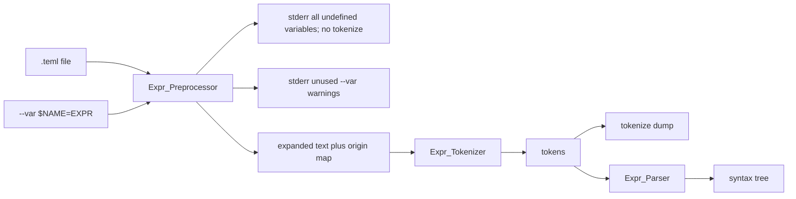

# TEML preprocessor

## Context

Today [`src/eml-cli.adb`](src/eml-cli.adb) reads a `.teml` file and hands the text straight to [`Expr_Tokenizer`](src/expr_tokenizer.ads). `$VARNAME` is a first-class token (`Variable`) and parse leaf (`Variable_Node`). There is no substitution and no `preproc` command.

This feature inserts a **textual** preprocessor **before** the tokenizer. After a successful preprocess, tokenize/parse never see `$VARNAME`. Leftover `$` is an invalid token. Diagnostics use the **original** `.teml` line/column, and if the offending text came from a substitution they append ` (from $VARNAME)`.

Work on **`feature/teml-preprocessor` from `main`**. Do not implement on `main`. The current working tree has unrelated idiv/percent edits; start this feature from a clean `main`, not mixed with that work. After the plan is accepted, wait for a chunk request (step 1 is creating the branch).

## Locked semantics

- **Command:** `eml preproc --input|-i <file.teml> [--output|-o <file.teml>] [--var|-v $VARNAME=EXPRESSION]... [--warn|-w default|none|error] [--no-color] [--no-logo]`
- **`--var` / `-v`:** repeatable, free flag order, space-separated only (same as `-i`). Value form is `$VARNAME=EXPRESSION` (dollar required, no space before `=`, split on the **first** `=`). EXPRESSION is pasted as-is (no parse, **no extra parentheses**, **no rescan** of the replacement). Quote in the shell: `--var '$X=1+2'`.
- **Missing binding (unbound `$VAR` in the file):** scan the **whole** file and report **every unbound occurrence** as an **error** (same name at two places → two diagnostics, each with its own line/column). If **any** unbound `$VARNAME` exists, do **not** write a dump and do **not** hand the text to the tokenizer (preproc/tokenize/parse all exit 1). Bound names are still substituted during the scan, but the expanded result is discarded on failure.
- **Unused `--var`:** a `--var $Y=…` whose name never appears in the file is **not** an error by default. After the scan, emit one warning per unused name: `warning: unused variable $Y` on stderr, **yellow** (`ESC[33m`) unless `--no-color`.
- **`--warn` / `-w`:** one of `default` (the default when the flag is omitted), `none`, `error`. Valid on `preproc`, `tokenize`, and `parse`. Repeated `--warn` is invalid CLI. Unknown value (including the old name `all`) is invalid CLI.
  - `default` — print every warning; do **not** stop; exit 0 if there are no errors
  - `none` — print no warnings; do not stop
  - `error` — treat every warning as an error (`error: unused variable $Y`, red unless `--no-color`); print **all** of them; **stop before the next stage** (no dump, no tokenize/parse); exit 1
- **No `$VAR` in the file:** output is **identical** to the text after the existing `Read_File` newline normalization (even with zero `--var`).
- **Repeated `--var` for the same name:** CLI error. **Empty EXPRESSION** (`--var $X=`): CLI error.
- **Malformed `$` / `$1`:** not a `$VARNAME`; left unchanged; tokenizer reports `unexpected character '$'`.
- **`$XX` vs `$X`:** longest match via the same regex as today: `\$[A-Za-z_][A-Za-z0-9_]*` ([`Regex_Automata.Match_Prefix`](src/regex_automata.ads)).
- **`tokenize` / `parse`:** always run preprocessor first. They accept `--var`/`-v` and `--warn`/`-w`. `--output-format` stays parse-only. `preproc -o` must end in `.teml`; omit `-o` → stdout.
- **Dumps:** each real token is still one line `<line>:<column> KIND lexeme` with **original** source positions. Tokens produced from one substitution share that `$VAR`’s start position. Around each run of tokens that came from the **same substitution occurrence**, the dump inserts comment lines that are **not** tokens and are **not** fed to the parser:

```
-- $VAR1 begin
1:8 NUMBER 1
1:8 PLUS +
1:8 NUMBER 2
-- $VAR1 end
```

  Consecutive tokens from the same original `$VAR` span (same name, line, and column) share one begin/end pair. A later occurrence of the same name gets its own pair. Adjacent substitutions (`$X$Y`) are two pairs. If a substitution yields no tokens (whitespace-only replacement), omit the pair. Source text that was not substituted has no markers.



Error and warning shapes (stderr):

- Unbound (red unless `--no-color`; one line per occurrence, then stop before tokenize): `error: undefined variable $X at line N, column M`
- Unused `--var` with `--warn default` (yellow unless `--no-color`): `warning: unused variable $Y`
- Unused `--var` with `--warn error` (red unless `--no-color`; then stop before tokenize): `error: unused variable $Y`
- Lex (from a var): `error: invalid token at line N, column M: unexpected character '@' (from $Y)`
- Parse (from a var): `error: parse error at line N, column M: unexpected end of input (from $X)`
- Non-var lex/parse: same messages as today (no `(from …)` suffix)

## Architecture

New package [`src/expr_preprocessor.ads`](src/expr_preprocessor.ads) / [`src/expr_preprocessor.adb`](src/expr_preprocessor.adb). It depends only on [`Regex_Automata`](src/regex_automata.ads) (not on the tokenizer). Left-to-right scan of the **entire** file: at each index try the variable regex; on match look up the binding and paste, or record an unbound diagnostic and continue; otherwise copy one character. After the scan, any `--var` name that was never matched is an **unused** name (the package returns the list; it does not decide warn vs error). Build a **per-character origin map** for the expanded string (`Line`, `Column`, `From_Var`, `Var_Name`) only when there are no unbound errors. If the unbound diagnostic list is non-empty, `Had_Error` is true and callers must not tokenize or write output.

[`Expr_Tokenizer.Tokenize`](src/expr_tokenizer.ads) grows an optional origin map argument. When present, token and diagnostic positions come from the map; diagnostic messages get ` (from $VAR)` when `From_Var`. When absent (unit tests on already-expanded text), keep today’s scan-based positions. Remove `Token_Kind.Variable` and `Variable_Pat`. [`Write_Dump`](src/expr_tokenizer.ads) inserts `-- $VAR begin` / `-- $VAR end` comment lines around each substituted token run (see Dumps). The parser never sees those lines.

[`Expr_Parser`](src/expr_parser.ads) drops `Variable_Node`. Copy `From_Var` / `Var_Name` from the failing token into the parse error (including end-of-input after a var-expanded prefix: use the last token’s origin instead of hard-coded `1:1` when the token list is non-empty). Tree dump labels unchanged.

CLI [`Run_Tokenize`](src/eml-cli.adb) / `Run_Parse` / new `Run_Preproc`: `Read_File` → `Preprocess` → print **all** unbound errors (red) if any → apply `--warn` to unused `--var` names (yellow warning, silent, or red error) → if unbound errors **or** (`--warn error` and any unused names), return 1 with no output file and no tokenize/parse → else existing tokenize/parse. Parse `--var`/`-v` and `--warn`/`-w` (not valid on `help`). Unbound errors and unused warnings may both be printed for the same run.

## Spec and docs (same commit as the matching step)

- [`.cursor/rules/eml-cli.mdc`](.cursor/rules/eml-cli.mdc): `preproc` command; `--var` and `--warn default|none|error` on preproc/tokenize/parse; tokenize dump begin/end comments; usage/help/examples; `Expected_Cmds` includes `preproc`; pipeline is preprocess then tokenize/parse.
- [`.cursor/rules/eml-architecture.mdc`](.cursor/rules/eml-architecture.mdc): `.teml → preprocessor → expr tokenizer → …`
- [`.cursor/rules/eml-source-language.mdc`](.cursor/rules/eml-source-language.mdc): `$VARNAME` is preprocessor syntax, not a parse primary. After preprocess, primaries are number, constant, `(e)`, `func(e)`. Future `eml run $NAME:VALUE` stays unimplemented and separate.
- [`README.md`](README.md): `preproc` section; `--var` and `--warn` on tokenize/parse; quoting; sample runner.

## Samples and runner

Keep parameterized samples (`$X`, `$A`, `$B`, `$R`, `$M`, `$C`, `$THETA`). [`scripts/run_samples.ps1`](scripts/run_samples.ps1) must pass dummy `--var` values for those names on **every** tokenize/parse/preproc invocation, plus **`--warn none`**, so unused dummy bindings do not spam stderr and the script stays green. Add a `preproc` operation writing `.teml` under `.results/preproc/`.

## Tests

**Preprocessor** ([`tests/expr_preprocessor_tests.adb`](tests/expr_preprocessor_tests.adb), wired from [`tests/eml_tests.adb`](tests/eml_tests.adb)):

- Happy: no `$VAR` → output equals input (spaces preserved); several occurrences of `$X`; `$X` and `$Y`; `$XX` vs `$X`; replacement `1+2` pasted without parens (`2*$X` → `2*1+2`).
- Origins: `$X` at column 8 replaced by `sin(pi)` → all expanded chars map to 1:8 and `$X`.
- Negative: unbound `$X` at known line/column, output unused; two unbound names and a repeated unbound `$X` → one diagnostic per occurrence, all reported; `$` / `$1` not treated as variables.
- Unused names: preprocessor result lists `--var $Y` that never appeared; bound names are absent from that list.

**Tokenizer / parser** (update existing suites):

- Replace `sin(pi+$X)` / `$VAR1` happy paths with non-var fixtures (`sin(pi+1)`, `e^(-1)`).
- Negative: `$X` passed **directly** to `Tokenize` → invalid `$` (and unknown `X`).
- With origin map: lex error on `@` from `$Y` reports original column and `(from $Y)`; parse `1+` from `$X=1+` reports original location and `(from $X)`.
- Dump: `sin(pi+$X)` with `--var $X=1` contains `-- $X begin` / `1:8 NUMBER 1` / `-- $X end`; two `$X` occurrences get two pairs; a file with no vars has no `--` lines.

**CLI** ([`tests/cli_tests.adb`](tests/cli_tests.adb)):

- Happy: `preproc` identity; `preproc --var $X=1+2` on `$X` writes `1+2`; tokenize/parse with `--var $X=1` on `sin(pi+$X)` (no `VARIABLE` in dump; `NUMBER 1` at original `$X` column, wrapped in `-- $X begin` / `-- $X end`); `-v` alias; flag order; stdout without `-o`.
- `--warn`: unused `--var $Y` on a file without `$Y` → exit 0 and a dump with omitted flag / `-w default`; silent with `-w none`; exit 1, **no** dump, with `-w error`; invalid `-w` value (including `all`); repeated `--warn`.
- Negative: unbound `$X` on preproc/tokenize/parse → exit 1, **no** output file, **no** tokenize dump; multiple unbound vars all reported; invalid `--var` syntax; missing `--var` value; repeated `--var $X`; `preproc -o` not `.teml`; `--var` on `help`; `eml help preproc` exit 0; unknown command list includes `preproc`.

Prove `alr build` and `alr run -- eml_tests` with **zero warnings**.

## Out of scope

- `eml compile` / `eml run`, `.eml` front-end, recursive macro expansion, auto-parentheses, VS Code extension, Graphviz.
